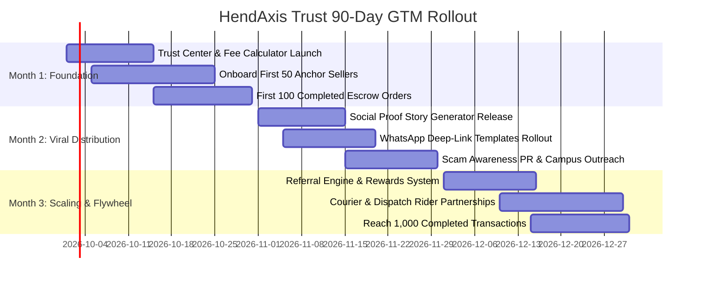

# HendAxis Trust — Comprehensive Marketing, Publicity & Go-To-Market (GTM) Master Plan

**Document Version:** 1.0 (Production Master)  
**Target Market:** Ghana (Initial Launch) ➔ Nigeria & Kenya (Phase 2 Expansion)  
**Positioning:** Trust Infrastructure for Social Commerce & Digital Escrow in Africa  
**Primary Audiences:** Instagram/TikTok/WhatsApp Merchants, High-Anxiety Online Buyers, Classifieds Traders, Independent B2B Contractors.

---

## 1. Executive Summary

HendAxis Trust is a specialized escrow infrastructure platform engineered to eliminate transaction default, fraud, and prepayment anxiety in African social commerce. 

In emerging digital economies like Ghana, e-commerce does not primarily happen on Amazon or Jumia; **over 70% of peer-to-peer and small merchant commerce occurs across WhatsApp, Instagram, TikTok, and Facebook Marketplace**. However, this informal digital economy suffers from an acute trust crisis:
- **Buyers** fear: *"If I send Mobile Money (MTN MoMo, Telecel Cash) upfront, the seller will block me or deliver counterfeit items."*
- **Sellers** fear: *"If I dispatch goods on Cash-on-Delivery (CoD) or pay for intercity bus waybills, the buyer will reject the delivery, waste my transport fees, or disappear."*

HendAxis Trust solves this two-sided impasse with an **instant, automated escrow smart-lock**:
1. Buyer locks funds securely into HendAxis Trust via MoMo/Card.
2. Seller is instantly notified via SMS/WhatsApp with guaranteed payment custody and dispatches the goods.
3. Buyer receives the item, verifies it with a time-limited OTP inspection period (e.g., 24–48 hours).
4. Upon buyer OTP confirmation or inspection expiry, funds are released directly to the seller’s Mobile Money wallet or bank account. If an issue arises, certified platform arbiters resolve disputes within 24 hours.

This document outlines the actionable, bootstrap-friendly, zero-waste Marketing, Publicity, and Growth Strategy to acquire the first 1,000 transacting merchants and 5,000 buyers, scaling efficiently into a self-sustaining network flywheel.

---

## 2. Product & Market Understanding

### The Core Problem: The Prepayment Paradox
In the Ghanaian market, trust is asymmetric:
- **Prepayment Anxiety:** Buyers have experienced "What I Ordered vs. What I Got" or outright scam ghosting.
- **Delivery Anxiety:** Sellers face delivery riders stealing cash, buyers refusing orders at destination bus parks, and bogus bank transfer screenshots.

```text
       ┌──────────────┐
       │    BUYER     │ ── 1. Deposits MoMo/Card (GHS) ──┐
       └──────────────┘                                    │
                                                           ▼
       ┌──────────────┐                          ┌──────────────────┐
       │    SELLER    │ ── 2. Dispatches Goods ─►│  HENDAXIS TRUST  │
       └──────────────┘    (Waybill Proof/OTP)   │ (Double-Entry    │
                                                 │  Escrow Vault)   │
                                                 └─────────┬────────┘
                                                           │
       ┌──────────────┐                                    │
       │  DELIVERY    │ ── 3. Inspected & OTP Confirmed ───┘
       └──────────────┘                                    │
                                                           ▼
                                                4. Automated MoMo Payout
```

### Market Sizing & Opportunity Context (Ghana)
- **Mobile Money Penetration:** Ghana boasts over 20+ million active Mobile Money accounts (Bank of Ghana annual payment reports), processing over GHS 1.5 Trillion annually.
- **Social Commerce Boom:** Over 8.2 million active social media users, with Instagram & WhatsApp serving as the de facto online storefronts for fashion, electronics, gadgets, cosmetics, and auto parts.
- **The CoD Bottleneck:** Cash-on-Delivery has an industry failure/return rate exceeding 25–35% for social media sellers due to uncommitted buyers. HendAxis Trust eliminates CoD risk while giving buyers 100% money-back security.

---

## 3. Target Customer Segmentation

We prioritize customer segments based on **transaction frequency, average order value (AOV), scam vulnerability, and ease of direct acquisition**:

| Tier | Customer Segment | Primary Channels | AOV (GHS) | Pain Point / Value Proposition | Priority |
| :--- | :--- | :--- | :--- | :--- | :--- |
| **Tier 1 (Anchor)** | **Instagram & TikTok Fashion / Sneaker / Gadget Sellers** | Instagram DM, WhatsApp, TikTok live | GHS 250 – 2,500 | "No more bogus buyers canceling waybills. Lock the payment before sending." | **Month 1 (Immediate)** |
| **Tier 1 (Anchor)** | **Used Tech & iPhone Traders (Circle / Classifieds / Tonaton / Jiji)** | WhatsApp groups, Facebook Marketplace | GHS 800 – 6,000 | "Eliminate fake bank alert scams and roadside inspection muggings." | **Month 1 (Immediate)** |
| **Tier 2** | **Intercity Bus Cargo & Waybill Shoppers (Accra ➔ Kumasi/Tamale/Takoradi)** | VIP/STC stations, Driver waybills | GHS 400 – 3,500 | "Buyer knows money is safe until bus parcel arrives; Seller gets guaranteed payout." | **Month 2** |
| **Tier 2** | **Freelance Creatives & Web Developers** | LinkedIn, X (Twitter), Developer Hubs | GHS 1,500 – 10,000 | "Milestone escrow: stop client ghosting on final deliverables." | **Month 2** |
| **Tier 3 (High Value)** | **Wholesale B2B / Spare Parts / Building Materials** | Direct sales, Trade associations | GHS 5,000 – 50,000+ | "Institutional trust for large shipments without formal letters of credit." | **Month 4+** |

---

## 4. Competitive Analysis & Strategic Moats

| Alternative / Competitor | How Ghanaians Currently Use It | Key Weakness / Risk | HendAxis Trust Advantage |
| :--- | :--- | :--- | :--- |
| **Direct MoMo Prepayment** | Buyer sends MoMo directly to merchant before dispatch. | Zero buyer protection. If seller blocks phone, money is lost forever. | Funds locked in third-party escrow; released only after physical inspection. |
| **Cash on Delivery (CoD)** | Dispatch rider/bus collects cash upon delivery. | 30% order cancellation rate; rider theft; seller loses double delivery fees. | Buyer commits funds upfront; seller dispatches with 100% confidence. |
| **Jumia / Marketplaces** | Sellers list products on centralized marketplace. | 15–25% commission; delayed 14-day payouts; merchant loses customer relationship. | Flat 1.5% + GHS 10 fee; merchant keeps their own Instagram/WhatsApp brand; instant payouts. |
| **Traditional Bank Escrow** | High-value commercial bank escrow agreements. | Heavy paperwork; minimum GHS 50,000+ threshold; takes weeks to setup. | 60-second payment link creation via mobile phone with instant MoMo integration. |

---

## 5. Positioning & Messaging Framework

### Recommended Positioning Framework
> **"The Trust Infrastructure for Social Commerce: Transact Safely with People You Don't Yet Know."**

We do not position as a "payment gateway" (competing with Paystack/Hubtel); we position as **Buyer & Seller Transaction Insurance**.

### Messaging Hierarchy

#### 1. One-Sentence Elevator Pitch (10 Seconds)
> *"HendAxis Trust holds your payment safely in escrow and only releases it to the seller after your package is delivered and inspected."*

#### 2. The 30-Second Commercial Pitch
> *"Buying on Instagram or WhatsApp? Don't send money into the dark. With HendAxis Trust, you pay into a secure escrow vault. The seller gets proof of payment and ships your item. You inspect your goods with a secure OTP code, and only then do we release the funds to the seller. Zero scams, zero lost deliveries."*

#### 3. Seller-Facing Value Proposition
> *"Tired of buyers canceling orders after you've paid for courier delivery? Send a HendAxis Trust payment link. Get paid immediately upon delivery without arguing over payment proofs or fake screenshots."*

---

## 6. The 10-Stage Trust-Building Ladder

Because an escrow platform sits between users and their money, trust must be established systematically:

```text
Stage 1: Transparent, ultra-fast website with live escrow fee calculator & terms
   ↓
Stage 2: Verified company registration (Registrar General Ghana, Data Protection Commission)
   ↓
Stage 3: Bank-Grade Security Explanation (Double-entry ledger, Paystack vaulting, 256-bit SSL)
   ↓
Stage 4: Verified Founding & Management Team (LinkedIn badges, public leadership)
   ↓
Stage 5: Accredited Dispute Arbiters (Formal 24-hour binding ruling guarantee)
   ↓
Stage 6: Real-time Public Scam Alert & Consumer Education Hub
   ↓
Stage 7: Verified Merchant Badges ("Protected by HendAxis Trust" Bio Embeds)
   ↓
Stage 8: Authentic Video Customer Testimonials (WhatsApp screenshots, unboxing proofs)
   ↓
Stage 9: Courier & Logistics Partnerships (Accredited bus and dispatch integrations)
   ↓
Stage 10: Defensible Reputation Flywheel (Public star ratings, transaction milestones)
```

---

## 7. Customer Acquisition Funnels (Zero/Low Budget)

### Funnel A: Instagram/TikTok Seller Direct Outreach (The "Anchor Seller" Strategy)
1. **Scouting:** Identify 50 active Instagram boutique/gadget sellers in Accra & Kumasi with 5k–50k followers who have "No Refund / Pay Before Delivery" in their bio.
2. **Personalized DM:** *"Hey @ShopName, we noticed your amazing collection. Many buyers hesitate to send GHS 500+ upfront. If you use HendAxis Trust links, buyers pay with 100% confidence while your money is 100% guaranteed before dispatch. We'll give your first 5 transactions 0% platform fees."*
3. **Activation:** Onboard seller in 3 minutes. Provide them with custom store URL (`hendaxistrust.com/store/shopname`) and "Verified Seller" badge.

### Funnel B: Buyer-Initiated Escrow Demand (The "Pull" Strategy)
1. **Viral Scam Warning Content:** TikTok/Instagram reels: *"3 signs an Instagram shoe seller is about to take your MoMo and block you."*
2. **Call to Action:** *"Next time a seller asks for full prepayment, tell them: 'Let's use HendAxis Trust so we are both protected.' If they refuse, they are likely a scammer."*
3. **Buyer Creates/Requests Link:** Buyer asks merchant for an escrow link, driving merchant onboarding.

---

## 8. Referral & Viral Growth Flywheel

```text
┌─────────────────────────────────────────────────────────────┐
│                       GROWTH FLYWHEEL                       │
│                                                             │
│   Seller Sends Escrow Link ➔ Buyer Experiences 0% Scam      │
│               ▲                                  │          │
│               │                                  ▼          │
│   Buyer Refers Friends /          Buyer Leaves Verified    │
│   Demands Escrow on Next Order    Rating & Story Card       │
│               ▲                                  │          │
│               │                                  ▼          │
│   Seller Embeds "Verified" Badge ➔ More Social Confidence   │
└─────────────────────────────────────────────────────────────┘
```

### Viral Referral Engine Design
- **Seller Referral Incentive:** Refer a fellow merchant ➔ Get GHS 15 escrow fee credits upon their first completed GHS 200+ transaction.
- **Buyer Referral Incentive:** Refer a buyer ➔ Both receive GHS 10 off platform fees on their next transaction.
- **Fraud-Guarded Attribution:** Bonuses are awarded **only upon full OTP completion of a real transaction** (preventing bot signups).

---

## 9. 90-Day Tactical Action Plan



### Week-by-Week Execution Matrix

- **Weeks 1–2 (Foundation & Conversion Optimization):**
  - Deploy Interactive Escrow Fee Calculator on homepage.
  - Launch dedicated `/for-buyers`, `/for-sellers`, `/how-it-works`, and `/trust-center` hubs.
  - Set up automated transactional SMS & WhatsApp notifications.
- **Weeks 3–4 (Anchor Seller Onboarding):**
  - Direct outreach to 100 Instagram gadget and fashion sellers in Circle/Osu/East Legon.
  - Secure first 50 verified stores with custom profile links.
  - Achieve first 50 completed, dispute-free transactions.
- **Weeks 5–6 (Viral Social Proof Activation):**
  - Roll out 1-click WhatsApp Status & IG Story Graphic generator for completed sales.
  - Release Embeddable "Protected by HendAxis Trust" badges for Linktree/Bio links.
- **Weeks 7–8 (PR & Educational Scam Campaign):**
  - Launch TikTok & Instagram educational series: *"The Safe Online Shopping Blueprint for Ghana"*.
  - Feature articles on TechLabari, JoyBusiness, and Ghanaian fintech podcasts.
- **Weeks 9–12 (Referral Acceleration & Growth):**
  - Enable In-App Referral Dashboard with completed-transaction wallet credits.
  - Launch Courier/Waybill partnership pilot with informal bus parcel offices (STC/VIP stations).
  - Reach milestone: 1,000 completed escrow orders and GHS 500,000+ GMV protected.

---

## 10. Customer Acquisition Unit Economics

### Baseline Scenario Model (Ghana Social Commerce)

| Metric | Conservative | Base Case | Target at Scale (Month 6) |
| :--- | :--- | :--- | :--- |
| **Average Order Value (AOV)** | GHS 350.00 | GHS 650.00 | GHS 850.00 |
| **Platform Fee (1.5% + GHS 10)** | GHS 15.25 | GHS 19.75 | GHS 22.75 |
| **Paystack Processing Cost (1.95%)** | GHS 6.83 | GHS 12.68 | GHS 16.58 |
| **Net Platform Revenue / Txn** | GHS 8.42 | GHS 7.07 | GHS 6.17 |
| **Merchant Blended CAC** | GHS 25.00 | GHS 15.00 | GHS 8.00 (Organic Flywheel) |
| **Repeat Transactions / Seller / Mo** | 4.2 orders | 8.5 orders | 14.0 orders |
| **Seller 6-Month LTV** | GHS 212.18 | GHS 360.57 | GHS 518.28 |
| **LTV / CAC Ratio** | **8.5x** | **24.0x** | **64.8x** |

---

## 11. 3-Tier Budget Allocation

```text
┌─────────────────────────┬─────────────────────────┬─────────────────────────┐
│     BOOTSTRAP TIER      │       GROWTH TIER       │     AGGRESSIVE TIER     │
│   (GHS 2,500 / Month)   │   (GHS 10,000 / Month)  │   (GHS 35,000 / Month)  │
├─────────────────────────┼─────────────────────────┼─────────────────────────┤
│ • 50% Founder DM / Sales│ • 35% Micro-Influencers │ • 40% Paid Performance  │
│ • 30% Referral Credits  │ • 30% Meta/TikTok Ads   │ • 25% Campus & Bus PR   │
│ • 20% Creative & Video  │ • 20% Referral Engine   │ • 20% Influencer Push   │
│                         │ • 15% Content Studio    │ • 15% Merchant Rebates  │
└─────────────────────────┴─────────────────────────┴─────────────────────────┘
```

---

## 12. Summary of Product Features to Support GTM Execution

To execute this marketing and growth master plan, the following product capabilities are directly mapped to phases:
1. **Phase 1 (Conversion & Trust Foundation):**
   - Interactive Fee & Protection Calculator (`EscrowFeeCalculator.tsx`).
   - Dedicated Landing Pages (`ForBuyersView.tsx`, `ForSellersView.tsx`, `HowItWorksView.tsx`, `TrustCenterView.tsx`).
2. **Phase 2 (Viral Distribution & Social Proof):**
   - Embeddable Trust Badges (`EmbeddableTrustBadge.tsx`).
   - 1-Click WhatsApp Status & Instagram Story Generator (`ShareableProofCard.tsx`).
   - WhatsApp Direct Deep-Link Share with pre-formatted escrow security text.
3. **Phase 3 (Referral Flywheel & SEO Hub):**
   - Database Referral Model & Fraud-Proof Completion Trigger.
   - Referral Dashboard in Merchant Center.
   - Safe Commerce & Scam Prevention SEO Resource Hub (`GuidesHubView.tsx`).

This master document forms the authoritative operational blueprint for HendAxis Trust's go-to-market execution.
