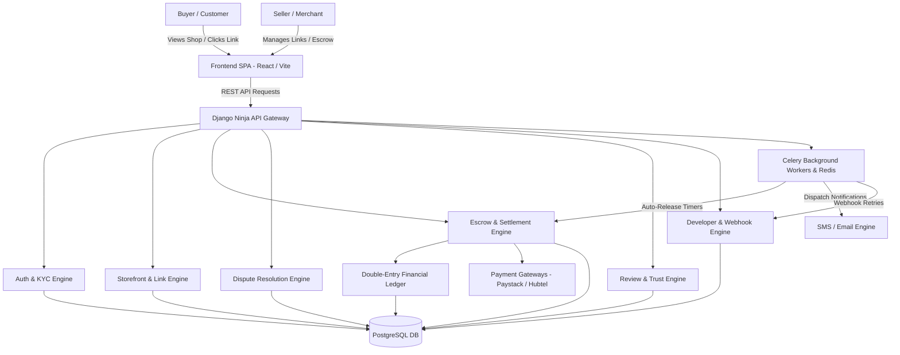
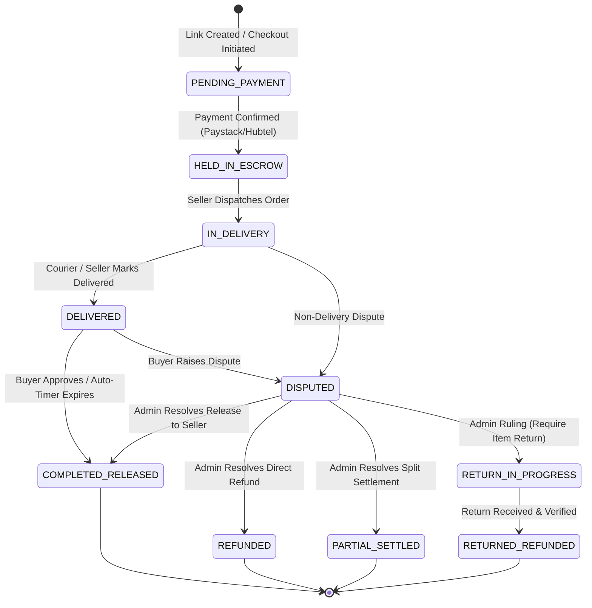

# HendTrust (Hendaxis Trust) — System & Feature Blueprint

> **Master Technical & Functional Reference Blueprint**  
> **Platform Version:** 2.0 (Production-Ready)  
> **Last Updated:** September 2026  

---

## 1. System Overview & Technology Stack

HendTrust is a financial trust infrastructure and escrow marketplace designed to eliminate payment fraud, delivery disputes, and buyer-seller friction in social commerce (Instagram, WhatsApp, TikTok, and web storefronts). Funds paid by buyers are held securely in platform escrow and are only released to sellers upon confirmed item delivery and buyer satisfaction.

### Core Tech Stack

| Layer | Technologies & Frameworks | Description / Role |
| :--- | :--- | :--- |
| **Frontend** | React 18, TypeScript, Vite, Tailwind CSS, Lucide Icons, Canvas-Confetti, XLSX, jsPDF & autoTable | High-performance SPA with responsive dark/light styling, interactive modals, carousels, data tables, and client-side PDF/Excel export. |
| **Backend API** | Python 3.11+, Django 5.x, Django Ninja (OpenAPI / Swagger) | High-speed, type-safe REST API endpoints with auto-generated Swagger documentation (`/api/docs`). |
| **Database** | PostgreSQL 16+ | ACID-compliant relational storage with strict foreign keys, transactional boundaries, and double-entry ledger constraints. |
| **Task Queue & Async Workers** | Celery 5.x, Redis 7.x, Celery Beat | Background execution of auto-release timer checks, webhook delivery, SMS/email dispatches, and periodic ledger checks. |
| **Payment Gateways** | Paystack API, Hubtel API, Mobile Money (MTN, Telecel, AT), GhanaQR | Multi-gateway routing for buyer card/MoMo payments, bank account verification, and automated seller payouts. |
| **Identity Verification** | NIA (National Identification Authority) Ghana Card API | Real-time automated identity verification against national database with manual admin review fallback. |

---

## 2. Architecture & Modular Subsystems Diagram



---

## 3. Detailed Feature Breakdown by Module

---

### Module A: Identity, Authentication & KYC System

#### Key Features & Workflows
1. **Multi-Role User Accounts**:
   - **Buyer**: Can purchase via payment links or storefronts, track orders, approve escrow release, raise disputes, submit reviews, and view purchase history.
   - **Seller / Merchant**: Can create stores, generate custom payment links, track sales, manage escrow balances, request payouts, configure payout accounts (MoMo/Bank), and view analytics.
   - **Admin / Operations**: Access to `/admin-portal` for global platform control, disputes desk, ledger auditing, user management, and manually approving KYC.

2. **Authentication & Session Security**:
   - JWT & Session token authentication.
   - Email verification via OTP (6-digit PIN code with timed expiration).
   - Phone number verification via SMS OTP.
   - Password reset workflow with secure tokenized URLs.
   - Optional 2FA (TOTP) support with emergency backup codes.

3. **Ghana Card Auto-Verification & Manual KYC**:
   - **Automated Verification**: Integrates directly with the National Identification Authority (NIA) API to match full legal name, date of birth, and Ghana Card PIN (`GHA-XXXXXXXXX-X`).
   - **Manual Verification Fallback**: Sellers can upload front/back photo of Ghana Card and business license documents. Admins review and approve/reject with detailed feedback in `/admin-portal`.
   - **Verified Seller Badge**: Once KYC is verified, a prominent **Verified Seller** checkmark badge appears on their profile, payment links, store page, and review modal.

#### Database Models (`backend/apps/users/models.py`)
- `User`: Custom user model with fields `role`, `ghana_card_number`, `is_identity_verified`, `is_business_verified`, `id_card_front_url`, `id_card_back_url`, `business_license_photo_url`, `payout_mode` (`MOMO` or `BANK`), `shop_category`, `advertised_until`.

---

### Module B: Seller Storefront & Marketplace Directory

#### Key Features & Workflows
1. **Custom Storefront URL (`/store/:username`)**:
   - Unique seller shop URL with custom store name, logo/avatar, cover banner, bio, social media handles (Instagram, WhatsApp, TikTok), and seller badges.
   - Showcases all active payment links/products created by the seller.
   - Embeds interactive seller review cards allowing buyers to read past customer reviews and open the detailed modal.

2. **Marketplace Directory (`/shops`)**:
   - Searchable directory of all active verified sellers on HendTrust.
   - Category filtering (Electronics, Fashion, Beauty, Home, Food, Services, etc.).
   - Search bar filtering by store name or business keywords.
   - Verified seller badge indicator and Trust Score rating preview.
   - Prominent **"View All Reviews"** button leading directly to the `/reviews` page.

3. **Featured / Sponsored Store Banner**:
   - Admin-configurable advertisement placement for sponsored sellers (`advertised_until` timestamp).

#### Database Models (`backend/apps/shops/models.py`)
- Storefront attributes are mapped directly on the `User` model, backed by category choices (`ELECTRONICS`, `FASHION`, `BEAUTY_HEALTH`, `HOME_FURNITURE`, `SERVICES`, etc.).

---

### Module C: Payment Links Engine

#### Key Features & Workflows
1. **Dynamic & Fixed Payment Link Creation (`/links`)**:
   - **Fixed Price Links**: Pre-set product title, price, description, and item image. Ideal for standard products.
   - **Dynamic Price Links**: Seller defines title and description; buyer enters custom payment amount at checkout (ideal for custom quotes, services, or invoices).
   - **Item Catalog Integration**: Optionally attach product stock image URL and custom SKU metadata.
   - **Delivery Configuration**: Set delivery fee options (Pickup, Fixed Delivery Fee, or Dynamic Courier Delivery).
   - **Fee Handling Preferences**:
     - **`PASS_TO_BUYER` (Default)**: Buyer pays Item Price + Delivery Fee + Platform Escrow Fee. Seller receives 100% of their item and shipping amount upon completion.
     - **`ABSORB_FEE`**: Buyer pays only Item Price + Delivery Fee. The platform escrow fee is automatically deducted from the seller's gross payout.
   - **Mathematical Fee Formula**:
     $$\text{Gross Transaction Value} = \text{Item Price (GHS)} + \text{Delivery Fee (GHS)}$$
     $$\text{Platform Escrow Protection Fee} = (\text{Gross Transaction Value} \times 1.5\%) + \text{GHS } 10.00$$
     $$\text{Gateway Processing / Transfer Fee} = \text{Disbursed Amount} \times 1.95\%$$
   - **Custom Checkout Fields**: Collect buyer delivery address, landmark, phone number, and optional notes.
   - **Stale Transaction Management & Auto-Archiving**: Unpaid transactions older than the platform's configured duration (`unpaid_auto_archive_days`, default: 3 days) automatically archive (`is_archived = True`). Sellers can click **"Check Payment"** on `AWAITING_PAYMENT` entries to manually query gateway completion before archiving occurs. Confirmed payments automatically restore transactions (`is_archived = False`).
   - **Archiving & Expiration**: Deactivate or archive stale links without breaking existing escrow histories.

2. **Public Checkout Page (`/pay/:slug`)**:
   - Clean, conversion-focused responsive checkout UI.
   - Real-time transparent fee calculation (Item Price + Delivery Fee + Escrow Protection Fee if passed to buyer).
   - Payment method selection:
     - **Mobile Money (MoMo)**: MTN Mobile Money, Telecel Cash, AT Money.
     - **Debit / Credit Card**: Visa, Mastercard.
     - **GhanaQR**: Instant QR code scan & pay.
   - Direct integration with Paystack / Hubtel inline modal or redirect API.
   - Upon successful payment verification, the transaction instantly transitions into an active **Held in Escrow** state.

#### Database Models (`backend/apps/links/models.py`)
- `PaymentLink`: Holds `title`, `slug`, `price_ghs`, `shipping_fee_ghs`, `fee_handling` (`PASS_TO_BUYER` / `ABSORB_FEE`), `is_dynamic_amount`, `description`, `image_url`, `is_archived`, `created_at`.

---

### Module D: Trust Escrow & Transaction Lifecycle

#### Key Features & Workflows
1. **Complete Escrow Lifecycle State Machine**:



2. **Auto-Release Timer Engine**:
   - When an order enters `DELIVERED`, a countdown timer begins (default 24 to 48 hours).
   - If the buyer does not raise a dispute before the timer expires, Celery Beat automatically triggers `auto_release_escrow()`, releasing funds to the seller's available wallet.

3. **Buyer Manual Release**:
   - Buyers receive an instant notification with a one-click **"Approve & Release Funds"** button upon receiving their item, immediately transferring funds to the seller.

4. **Item Return Subsystem (`RETURN_IN_PROGRESS` ➔ `RETURNED` / `REFUNDED`)**:
   - **Return Initiation**: Initiated when an admin dispute ruling requires item return (`REQUIRE_RETURN_FROM_BUYER`).
   - **Dual Return Dispatch**: Buyer dispatches returned item via Courier (tracking number + waybill photo) or Informal Bus Station (driver phone, car registration, destination station, waybill photo).
   - **Reverse Pickup OTP**: Generates a 6-digit Reverse OTP for informal bus returns to guarantee safe arrival back to seller.
   - **Seller Verification & Auto-Refund**: Once seller confirms receipt intact (or return auto-refund window expires), transaction transitions to `RETURNED` / `REFUNDED` and funds are disbursed to the buyer.

5. **Seller Dispatch Deadline, Pre-Expiry Progressive Reminders & Penalties**:
   - **Configurable Dispatch Window**: Once payment is confirmed (`PAYMENT_RECEIVED`), the seller must dispatch the order within the platform-configured timeframe (`shipping_timeout_days`, default: 4 days / 96 hours).
   - **Progressive Pre-Expiry Alerts**: Celery tasks run periodically (`check_dispatch_expiry_reminders`):
     - **24-Hour Reminder**: Dispatched via SMS & Email when $\le 24\text{ hours}$ remain, warning the seller of the approaching deadline and detailing the exact non-dispatch penalty (Platform Fee + 1.95% Gateway Fee).
     - **6-Hour Final Warning**: High-priority alert dispatched when $\le 6\text{ hours}$ remain, advising immediate dispatch or order cancellation penalty execution.
   - **Automated Non-Dispatch Cancellation & Debit**: If the seller fails to dispatch before expiry (`check_expired_dispatches`):
     - The transaction is automatically marked `auto_cancelled_non_dispatch = True` and transitioned to `CANCELLED`.
     - The buyer receives an immediate 100% full refund (including all fees).
     - The defaulting seller is charged the itemized penalty (Platform Fee + 1.95% Gateway Processing Fee) debited against their wallet balance or future payouts.

6. **MoMo & Bank Payout Validation**:
   - Payout destination options: Mobile Money (MoMo) or Bank Account.
   - Automated name-matching validation using gateway lookup (Paystack / Hubtel Bank Resolve API).
   - Verification records (account name, account number, bank/network name) are recorded permanently against every withdrawal transaction in the ledger for future auditability.

#### Database Models (`backend/apps/escrow/models.py`)
- `EscrowTransaction`: Holds `transaction_ref`, `buyer`, `seller`, `payment_link`, `amount`, `delivery_fee`, `platform_fee`, `status`, `delivery_pin`, `return_confirmation_code`, `return_waybill_photo_url`, `reminder_24h_dispatch_sent`, `auto_cancelled_non_dispatch`, `auto_release_at`, `created_at`, `updated_at`.

---

### Module E: Dispute Resolution & Seller Health Governance Subsystem

#### Key Features & Workflows
1. **Dispute Initiation & Subsequent Detail Appending (`/dashboard`, `/l/:id`, `/tracking`)**:
   - Either party (Buyer or Seller) can open a dispute if an issue arises (e.g., non-delivery, damaged goods, wrong item).
   - **Subsequent Dialogue & Reason Appends**:
     - Buyers can add further clarification notes and photos to an ongoing dispute without overwriting past submissions. Updates are appended with audit timestamps: `--- [Buyer Update (Timestamp)] ---`.
     - Sellers can add multiple counter-responses and additional evidence over time (`--- [Seller Response (Timestamp)] ---`).
   - **Multi-Photo Accumulation**: Each party can upload up to **5 WebP-compressed evidence photos** across their dispute updates.
   - **WhatsApp-Style Chronological Dialogue Trail (`DisputeChatTimeline`)**:
     - Unifies all claim descriptions, seller statements, dispatch waybill proofs, arbitrator resolution notes, and retraction system events into a single, color-coded, WhatsApp-style conversation stream.
     - **Buyer messages**: Left-aligned, dark slate/white bubble, rose accent header (`text-rose-600`), user icon.
     - **Seller responses**: Right-aligned, soft mint/emerald background (`bg-emerald-50/90 dark:bg-emerald-950/40`), store icon.
     - **Arbitrator rulings**: Centered purple resolution card (`bg-purple-50 dark:bg-purple-950/40`), scale icon (`⚖️`).
     - **Retraction events**: Centered amber status card (`bg-amber-100 dark:bg-amber-950/60`), shield check icon.
     - **Read More / Collapsible Trail**: Long text (> 260 characters) includes `Read more...` / `Read less` toggles; large dialogues (> 4 updates) feature a top `Show Earlier Updates (N)` / `Collapse Trail` banner with smooth scrolling.

2. **Dispute Retraction & Private Settlement (`/l/:id`)**:
   - **Buyer Self-Retraction**: Buyers who reach a mutual agreement with the seller outside formal arbitration can retract their dispute directly from their order page (`/l/:id`).
   - **Automated Delayed Settlement (Default 24 Hours)**: Upon retraction (`dispute_retracted_at = timezone.now()`), the dispute is closed, and escrow funds are scheduled for automatic release to the seller after 24 hours (governed by the configurable platform setting `dispute_retraction_release_hours`).
   - **Permanent Rating Voidance**: To protect system integrity and prevent retaliatory or coerced review manipulation, any transaction that experienced a dispute permanently loses review eligibility—the rating capability remains voided even after retraction.

3. **Automated Seller Dispute Health Monitoring & Account Suspension**:
   - **Multi-Window Calculation**: System computes seller dispute percentage across (1) Last 30 Days, (2) Last 15 Sales, and (3) Lifetime Sales, selecting the highest dispute rate among sets with `paid_transactions >= dispute_min_sample_size` (default: 5) to prevent low-volume sample distortion.
   - **Configurable Platform Thresholds (`/admin/settings`)**:
     - **Dispute Minimum Sample Size (Default: 5 Txns)**: Number of paid transactions required before dispute rate evaluation begins.
     - **Yellow Alert Banner (Default: ≥ 20% Dispute Rate)**: Displays inline caution on seller dashboard.
     - **Orange Warning Banner (Default: ≥ 30% Dispute Rate)**: Displays high-priority warning banner and sends an email notification to seller.
     - **Red Suspension Banner (Default: ≥ 40% Dispute Rate or Admin Action)**: Sets seller account status to `is_suspended = True`.
   - **Suspension Enforcement**: Deactivates all active payment links, blocks payment link creation, and returns HTTP 403 Forbidden on public checkout for suspended seller links.
   - **In-Flight Order Continuity**: In-flight orders that were already paid prior to suspension remain active and proceed through the full fulfillment, delivery, inspection, dispute, and payout lifecycle.

4. **Automated Seller Rating Governance & Thresholds**:
   - **Aggregated Rating Calculation**: Computes average star rating from active customer reviews (`SellerReview.objects.filter(seller=seller_user, is_active=True)`).
   - **Rating Warning Banner (Default < 3.0 Stars)**: Triggers an inline warning notice on seller dashboard and sends a caution email to the seller.
   - **Rating Auto-Suspension (Default < 2.0 Stars with min 3 reviews)**: Automatically sets `is_suspended = True`, deactivates active payment links, and sends suspension alert email.

5. **Automated Dispatch Expiry Governance & Thresholds**:
   - **Non-Dispatch Rate Calculation**: Computes the ratio of non-dispatch cancelled orders (`auto_cancelled_non_dispatch = True`) to total paid transactions.
   - **Dispatch Expiry Warning Banner (Default ≥ 20% Expiry Rate)**: Triggers an amber warning banner on the seller dashboard detailing non-dispatch metrics.
   - **Dispatch Expiry Auto-Suspension (Default ≥ 35% Expiry Rate with min sample size >= 5)**: Automatically sets `is_suspended = True`, deactivates all active links, records the suspension reason, and alerts the seller.

6. **Post-Reinstatement Clean Slate & Immunity Protection**:
   - When an administrator manually reinstates a seller or approves an appeal, `seller.reinstated_at = timezone.now()` is recorded.
   - `compute_seller_dispute_health` filters evaluated transactions strictly to `created_at__gte=seller.reinstated_at`.
   - This gives reinstated merchants a clean slate and ensures they are not immediately re-suspended by historical transactions during the next Celery health check cycle, requiring 5 new paid transactions before thresholds are evaluated again.

7. **Account Suspension Appeals & Admin Appeals Desk (`/admin-portal`)**:
   - **Payment Link Creation Modal UX**: Attempting to generate a payment link while suspended renders a dedicated modal explaining the exact suspension cause and offering an inline appeal form.
   - **Seller Appeal Submission (`POST /api/profile/appeal-suspension`)**: Suspended sellers submit a formal justification with remediation steps.
   - **Stale Appeal Status Isolation (`GET /api/profile/appeal-status`)**: Only appeals created after the current suspension timestamp are evaluated, preventing old rejected appeals from blocking new appeals.
   - **Admin Suspension Appeals Desk (`/admin-portal/dashboard` Tab 4)**: Administrators inspect appeals, review seller metrics, and approve (reinstating the account with `reinstated_at` set) or reject with notes.

8. **Admin Mediation Desk & Resolution Notifications (`/admin-portal`)**:
   - Dedicated interface displaying all active and past disputes.
   - Embedded `DisputeChatTimeline` showing full chronological conversation stream and uploaded evidence.
   - Direct action buttons for Admin Resolution (Full Refund, Release to Seller, Split Settlement, Require Item Return).
   - Personalized Email & SMS notifications addressing buyers by First Name and sellers by Shop Name with exact Transaction Reference IDs.

#### Database Models (`backend/apps/escrow/models.py`, `backend/apps/users/models.py`)
- `EscrowDispute`: Holds `escrow`, `raised_by`, `reason`, `description`, `evidence_urls`, `status`, `resolution_notes`, `resolved_by`, `resolved_at`.
- `SuspensionAppeal`: Holds `user`, `reason`, `status` (`PENDING`, `APPROVED`, `REJECTED`), `admin_notes`, `reviewed_by`, `created_at`, `reviewed_at`.
- `User`: Extended with `is_suspended`, `suspension_reason`, `suspended_at`, and `reinstated_at`.

---

### Module F: Logistics, Delivery Tracking & Upfront OTP Verification

#### Key Features & Workflows
1. **Universal Upfront 2-Step OTP Package Tracking (`/tracking`, `TrackingModal.tsx`)**:
   - **Track by Order ID (Single Item)**:
     - **Step 1 (`INPUT`)**: Buyer inputs Transaction Reference ID and Phone Number &rarr; Clicks *"Send Verification OTP Code"*.
     - **Step 2 (`OTP`)**: Buyer enters the 6-digit OTP code sent via SMS &rarr; Order status details and actions unlock immediately.
   - **Full Order History (Multi-Item)**:
     - **Step 1 (`INPUT`)**: Buyer inputs Phone Number or Email &rarr; Clicks *"Send Verification OTP Code"*.
     - **Step 2 (`OTP`)**: Buyer enters 6-digit OTP &rarr; Returns all associated transactions.
   - **2-Hour OTP Validity & 60-Second Cooldown**:
     - Tracking OTPs are cryptographically hashed in Redis with a 2-hour TTL (`_OTP_TTL = 7200s`).
     - Includes a 60-second client/server resend cooldown timer and a *"← Change Reference/Phone"* back navigation button.
   - **Zero Secondary Auth Popups**: Once verified upfront, all order card actions (**View Full Details & Actions**, **+ Add Dispute Details**, **Manage / Retract**, **Confirm Receipt**, **Raise Dispute**, **⭐ Rate Seller**) are immediately unlocked and fully functional with no secondary OTP challenges.

2. **Logistics Gateway Integrations & Webhook Tracing**:
   - Webhook listeners for automated status updates from courier partners (Hubtel Logistics, Yango Delivery, local dispatch API).
   - **60-Second OTP SMS Cooldown**: Delivery confirmation OTP requests (`send_confirmation_code`) enforce a 60-second cooldown period, preventing duplicate SMS dispatches while retaining active codes for confirmation.
   - **Full-Screen Image Lightbox**: Product photos and delivery proof thumbnails feature a full-screen zoom lightbox modal (`ImageLightboxModal.tsx`) with 90° rotation and download controls.

#### Database Models (`backend/apps/delivery/models.py`)
- `DeliveryRecord`: Holds `escrow`, `courier_name`, `tracking_number`, `dispatch_status`, `delivery_pin`, `estimated_delivery_time`, `delivered_at`.

---

### Module G: Customer Review, Rating & Security Hardening

#### Key Features & Workflows
1. **Verified Review Submission & 1 Review Per Transaction**:
   - **1 Review Per Transaction**: Enforced via `SellerReview.transaction` `OneToOneField`. Submitting feedback again for an order updates the original review.
   - **Transparent Edit Counter & Timestamps (`edit_count`)**: Every review update increments an internal `edit_count` and updates `updated_at`. Storefront and review feeds transparently display `Edited X times • Last edited on [Date]`.
   - **Transit Rating Lock**: Rating a seller is locked while a package is in transit (`AWAITING_PAYMENT`, `PAYMENT_RECEIVED`, `DELIVERY_IN_PROGRESS`) displaying `🔒 Rate Seller (Unlocks upon delivery)` and unlocks upon delivery/inspection.
   - **Cryptographic Review Token (`buyer_review_token`)**: Returned strictly in buyer checkout responses; excluded from seller API endpoints to prevent seller review tampering/forgery.
   - **$0-Cost Email Magic Link Fallback**: Buyers editing a review from a new device can request a free magic link emailed to `buyer_email` (`/reviews/request-edit-link`).
   - Multi-metric star ratings: **Item Quality**, **Delivery Speed**, **Communication** (1 - 5 Stars).

2. **Interactive `ReviewDetailModal`**:
   - Opens detailed view of customer review with reviewer avatar, verified buyer badge, review text, uploaded product photo, exact metric breakdowns, and helpfulness voting buttons (Thumbs Up / Down).
   - Features configurable `showVisitStoreButton` prop (hidden when viewed directly on seller storefront page).

3. **Dedicated "All Reviews" Page (`/reviews`)**:
   - Central repository of all customer reviews across the platform.
   - Star-rating filter chips (All, 5★, 4★, 3★, 2★, 1★).
   - Real-time search bar filtering by seller name, item title, or comment text.

4. **Homepage & Marketplace Review Carousels**:
   - Visual carousels embedded on Home (`/`) and Shops (`/shops`) showcasing top reviews with **"Verified Rating"** headers and **"View All Reviews"** navigation buttons.

#### Database Models (`backend/apps/reviews/models.py`)
- `SellerReview`: Holds `transaction` (`OneToOneField`), `seller`, `buyer`, `rating`, `quality_rating`, `speed_rating`, `communication_rating`, `comment`, `image_url`, `edit_count`, `created_at`, `updated_at`.
- `ReviewVote`: Tracks user votes (`UPVOTE` / `DOWNVOTE`) to prevent duplicate voting.

---

### Module H: Double-Entry Financial Ledger & Platform Funds

#### Key Features & Workflows
1. **Strict Double-Entry Ledger Architecture**:
   - Immutable financial accounting system (`LedgerEntry`).
   - Every movement of money balances two equal debits and credits across accounts:
     - `ESCROW_HOLDING`: Total buyer funds currently held in escrow.
     - `SELLER_AVAILABLE`: Cleared seller balances eligible for payout.
     - `PLATFORM_FEE_REVENUE`: Platform service fee revenue earned.
     - `GATEWAY_FEE_EXPENSE`: Processing fees charged by Paystack/Hubtel.
     - `PAYOUT_PENDING`: Seller withdrawal requests queued for processing.

2. **Wallet & Withdrawal Management (`/ledger`)**:
   - Real-time display of Seller Available Balance, Pending Escrow, and Total Paid Out.
   - Withdrawal request modal supporting MoMo or Bank account transfer.
   - Real-time bank account name lookup and verification.
   - Audit log recording exact payout account details (`payout_account_name`, `payout_account_number`, `payout_bank_name`) on every ledger transaction.

3. **Ledger Integrity Check**:
   - Automated periodic task validating `SUM(Debits) == SUM(Credits)` across all accounts. Alerts admin if any imbalance is detected.

#### Database Models (`backend/apps/ledger/models.py`) & (`backend/apps/wallet/models.py`)
- `SellerWallet`: Holds `seller`, `available_balance`, `pending_escrow_balance`, `total_withdrawn`, `bank_name`, `bank_account_number`, `bank_account_name`, `momo_network`, `momo_number`, `momo_name`.
- `LedgerEntry`: Holds `transaction_ref`, `entry_type`, `amount`, `debit_account`, `credit_account`, `payout_account_name`, `payout_account_number`, `payout_bank_name`, `created_at`.

---

### Module I: Developer API & Webhook Dispatcher

#### Key Features & Workflows
1. **Developer API Portal (`/developer`, `/developer/keys`)**:
   - Self-service portal for technical merchants and platforms integrating HendTrust escrow into custom websites or mobile apps.
   - Generation of Sandbox (`test_sk_...`) and Live (`live_sk_...`) API keys.

2. **Webhook Engine**:
   - Configure webhook endpoint URL and signing secret.
   - Dispatches real-time HMAC-SHA256 signed JSON payloads for events:
     - `escrow.created`
     - `escrow.held`
     - `escrow.dispatched`
     - `escrow.delivered`
     - `escrow.released`
     - `dispute.opened`
     - `dispute.resolved`
   - Automated retry logic with exponential backoff for failed webhook deliveries.

#### Database Models (`backend/apps/developer/models.py`)
- `APIKey`: Holds `user`, `key_prefix`, `hashed_key`, `environment` (`SANDBOX` / `LIVE`), `is_active`, `created_at`.
- `WebhookEndpoint`: Holds `user`, `target_url`, `secret_key`, `is_active`, `events_subscribed`.
- `WebhookDeliveryLog`: Records response status code, execution duration, payload, and retry attempts.

---

### Module J: Admin Operations & Multi-Party Intelligence Portal

#### Key Features & Workflows
1. **Master Overview Dashboard (`/admin-portal`)**:
   - High-level KPIs: Total Platform Volume (GHS), Active Escrows, Total Platform Revenue, Total Registered Users, Active Sellers.
   - Real-time Ledger Balance & Platform Funds status.

2. **All Transactions Management & Deep Inspection**:
   - Filterable datatable of all transactions across the system with status filters (Pending, Escrow Held, Delivered, Released, Disputed, Refunded).
   - Deep Inspection Modal (`selectedTxnId`) providing direct access to double-entry ledger audits, delivery logs, waybill inspection photos, and 1-click links to Buyer and Seller intelligence profiles.
   - One-click export to **PDF** and **Excel** formats.

3. **Dispute Resolution & Arbitration Intelligence Desk**:
   - Centralized queue for resolving open buyer/seller disputes.
   - Side-by-side **Seller Storefront Dossier** (`<AdminSellerDetailsModal>`) and **Buyer Intelligence Dossier** (`<AdminBuyerDetailsModal>`) cards inside the arbitration modal so arbiters can inspect past histories before ruling.
   - Embedded `DisputeChatTimeline` showing full chronological conversation stream and uploaded evidence.

4. **360° Buyer / User Intelligence Engine (`GET /admin/buyers/intelligence`)**:
   - Arbiters can query any buyer or user by **Phone Number, Email Address, or User ID**.
   - Comprehensive multi-tab profile:
     - **Identity & KYC**: Registered user status, verified Ghana Card status, phone/email verification badges.
     - **Spend & Escrow Volume**: Lifetime orders, total GMV spent (GHS), active orders in escrow.
     - **Dispute Health & Serial Disputer Profiling**: Total disputes raised, dispute rate %, retracted dispute tally, refunded/cancelled order tallies.
     - **Known Shipping Addresses**: Unique list of historical delivery addresses with 1-click copy.
     - **Full Order Trail & Dispute Records**: Chronological orders placed across all sellers with direct audit links.
     - **Submitted Seller Reviews**: All ratings and written feedback left for merchants.

5. **Seller Storefront & Compliance Intelligence Engine (`GET /admin/sellers/:id/details`)**:
   - 1-click administrative summary displaying store banners, avatar, verified KYC status, active/archived payment links, lifetime revenue, wallet balance, customer review metrics (overall, speed, communication), and automated compliance health flags.

6. **User & Identity Verification Desk**:
   - Review pending Ghana Card submissions, view documents, approve/reject identity verification with instant badge synchronization.

7. **Seller Directory & Dual Health Risk Status**:
   - Full list of all registered sellers displaying verified transaction metrics and dual risk badges (`Disputes: X.X%` and `Expiry: X.X%`).
   - Manual admin actions to Suspend or Reinstate seller accounts.

8. **Suspension Appeals Desk (Tab 4)**:
   - Centralized interface displaying all seller account suspension appeals with real-time status (`PENDING`, `APPROVED`, `REJECTED`).
   - Side-by-side view of seller justification and remediation proposal.
   - Administrative review actions to Approve (with automatic clean-slate reinstatement `seller.reinstated_at = timezone.now()`) or Reject with notes.

9. **Dynamic Platform & Governance Settings (Tab 7)**:
   - Superuser live configuration for Payment Gateway, Carrier providers, Shipping Timelines, Return Windows, Dispute Governance Thresholds (Min Sample, Alert, Warning, Suspension), and Dispatch Expiry Governance Thresholds (`dispatch_expiry_warning_threshold`, `dispatch_expiry_suspension_threshold`).

#### Frontend Components
- [`AdminDashboardView.tsx`](file:///d:/PROJECTS/Hend_Trust/frontend/src/views/AdminDashboardView.tsx)
- [`AdminSellerDetailsModal.tsx`](file:///d:/PROJECTS/Hend_Trust/frontend/src/components/AdminSellerDetailsModal.tsx)
- [`AdminBuyerDetailsModal.tsx`](file:///d:/PROJECTS/Hend_Trust/frontend/src/components/AdminBuyerDetailsModal.tsx)


---

### Module K: Multi-Channel Notifications & Support Hub

#### Key Features & Workflows
1. **Notification Hub**:
   - **SMS Notifications** (Hubtel / Arkesel): Transmits payment confirmation, tracking links, delivery OTPs, pre-dispatch progressive warnings (24h and 6h with itemized fee penalties), and escrow release alerts directly to mobile phones.
   - **Email Notifications** (SMTP / SendGrid): Sends HTML transactional receipts, dispute updates, pre-dispatch penalty warnings, and account suspension notifications.
   - **In-App Notifications**: Real-time bell icon dropdown for active users.

2. **Help & Support Center (`/help`, `/contact`)**:
   - Interactive FAQ accordion covering common buyer and seller questions.
   - Contact support form with direct ticket generation.

#### Database Models (`backend/apps/notifications/models.py`)
- `Notification`: Holds `recipient`, `title`, `message`, `type`, `is_read`, `created_at`.
- `BroadcastCampaign`: Admin tool for sending platform announcements to users.

---

### Module L: Data Export & Reporting Engine

#### Key Features & Workflows
1. **Excel Export (`XLSX`)**:
   - Generates formatted `.xlsx` spreadsheets complete with header styles, formatted currency columns, auto-calculated column widths, and summary rows.
   - Available on: All Transactions table, Dispute Logs, Platform Ledger, Seller Directory, and Buyer Phone Registry.

2. **PDF Report Export (`jsPDF` + `autoTable`)**:
   - Generates branded, styled PDF reports with HendTrust logo headers, execution metadata (Timestamp, Admin User), clean table grids, and page numbers.
   - Available across all admin data tables and financial ledger views.

---

## 4. Frontend Route & Page Sitemap

| Path | View Component | Access Level | Description |
| :--- | :--- | :--- | :--- |
| `/` | `HomeView.tsx` | Public | Homepage showcasing hero banner, interactive Escrow Fee Calculator, floating calculator widget, how escrow works, reviews carousel, and CTA. |
| `/for-buyers` | `ForBuyersView.tsx` | Public | Dedicated buyer landing page highlighting 100% money-back guarantee, MoMo escrow protection, OTP delivery, and inspection windows. |
| `/for-sellers` | `ForSellersView.tsx` | Public | Dedicated seller landing page detailing zero payment defaults, instant payment links, bus/courier dispatch options, and fee handling. |
| `/how-it-works` | `HowItWorksView.tsx` | Public | Step-by-step visual escrow walkthrough with integrated interactive live Escrow Fee Calculator. |
| `/trust-center` | `TrustCenterView.tsx` | Public | Trust, safety, bank-grade ledger security, KYC compliance, and buyer/seller dispute rules. |
| `/guides` | `GuidesHubView.tsx` | Public | Visual step-by-step educational guides hub for buyers and sellers in Ghana social commerce. |
| `/shops` | `ShopsDirectoryView.tsx` | Public | Directory of verified sellers with category filters, search bar, and recent reviews carousel. |
| `/store/:username` | `SellerStoreView.tsx` | Public | Individual seller storefront displaying store banner, bio, social links, products, and customer review cards. |
| `/reviews` | `ReviewsView.tsx` | Public | Dedicated All Reviews page with star-rating filter chips (1★-5★) and live search bar. |
| `/pay/:slug` | `PublicCheckoutView.tsx` | Public | Secure checkout page for buyers to pay via MoMo, Card, or GhanaQR with real-time fee calculation. |
| `/tracking` | `TrackingView.tsx` | Public | Order tracking page for inspecting order progress using reference number and upfront 2-step OTP verification. |
| `/help` | `HelpView.tsx` | Public | Help Center & FAQ platform guide. |
| `/contact` | `ContactView.tsx` | Public | Customer support contact page. |
| `/login` | `LoginView.tsx` | Public | Account login page. |
| `/register` | `RegisterView.tsx` | Public | Buyer & Seller registration page with referral code tracking. |
| `/forgot-password` | `ForgotPasswordView.tsx` | Public | Password recovery request page. |
| `/reset-password` | `ResetPasswordView.tsx` | Public | Password reset entry page. |
| `/activate` | `ActivateAccountView.tsx` | Public | Email OTP activation page. |
| `/dashboard` | `DashboardView.tsx` | Authenticated | Buyer & Seller main dashboard for managing orders, payment links, referral rewards, and disputes. |
| `/links` | `LinksView.tsx` | Authenticated (Seller) | Payment link creation and management interface. |
| `/links/create` | `CreatePaymentLinkView.tsx` | Authenticated (Seller) | Form for building dynamic or fixed price payment links with Account Suspended modal appeal integration. |
| `/ledger` | `LedgerView.tsx` | Authenticated (Seller) | Financial wallet, balance breakdown, and withdrawal requests. |
| `/profile` | `ProfileView.tsx` | Authenticated | User profile management, security settings, embeddable trust badges, and Ghana Card KYC upload. |
| `/developer` | `DeveloperView.tsx` | Authenticated (Seller) | Developer documentation, API overview, and webhook configuration. |
| `/developer/keys` | `DeveloperKeysView.tsx` | Authenticated (Seller) | API Key management portal (Live vs Sandbox keys). |
| `/admin-portal` | `AdminDashboardView.tsx` | Admin Only | Master operations dashboard, disputes desk, KYC approvals, suspension appeals desk, ledger audits, and platform settings. |

---

## 5. Backend REST API Reference Endpoint Mapping

### Authentication & User Endpoints (`/api/users/`)
- `POST /api/users/register`: Register new user account.
- `POST /api/users/login`: Authenticate and obtain session/JWT token.
- `POST /api/users/verify-email`: Confirm email via OTP PIN.
- `POST /api/users/resend-otp`: Request fresh OTP PIN.
- `POST /api/users/verify-ghana-card`: Submit Ghana Card for automated NIA or manual verification.
- `GET /api/users/me`: Fetch authenticated user profile details.
- `PUT /api/users/profile`: Update bio, logo, banner, and store settings.
- `POST /api/users/verify-bank-account`: Validate MoMo/Bank account details against Paystack/Hubtel lookup API.
- `POST /api/profile/appeal-suspension`: Submit account suspension appeal with detailed remediation justification.
- `GET /api/profile/appeal-status`: Check current active appeal status and admin ruling notes.

### Payment Links Endpoints (`/api/links/`)
- `GET /api/links`: List all payment links created by seller.
- `POST /api/links`: Create new fixed or dynamic payment link (blocked if seller is suspended).
- `GET /api/links/public/{slug}`: Fetch payment link public details for checkout.
- `PUT /api/links/{id}/archive`: Archive a payment link.

### Escrow Transactions & Disputes Endpoints (`/api/escrow/`)
- `POST /api/escrow/initialize`: Initialize public checkout session (Paystack/Hubtel).
- `POST /api/escrow/webhook`: Payment gateway callback webhook receiver.
- `GET /api/escrow/my-transactions`: List buyer or seller transactions.
- `POST /api/escrow/{id}/dispatch`: Mark order as dispatched with optional courier info.
- `POST /api/escrow/{id}/mark-delivered`: Mark order as delivered.
- `POST /api/escrow/{id}/release`: Buyer approves and releases escrow funds to seller.
- `POST /api/escrow/{id}/dispute`: Raise dispute on an escrow transaction.
- `POST /api/escrow/admin/resolve-dispute`: Admin action to resolve dispute (Refund, Release, Split).
- `GET /api/escrow/admin/settings`: Fetch dynamic platform and governance settings.
- `POST /api/escrow/admin/settings`: Update platform settings and governance thresholds.
- `GET /api/admin/appeals`: List all seller suspension appeals.
- `POST /api/admin/appeals/{id}/review`: Approve or reject suspension appeal.

### Customer Reviews Endpoints (`/api/reviews/`)
- `GET /api/reviews/feed`: Fetch recent verified reviews feed for carousels & `/reviews` page.
- `GET /api/reviews/seller/{username}`: Fetch all reviews for a specific seller storefront.
- `POST /api/reviews/submit`: Submit a verified review with ratings and optional item photo.
- `POST /api/reviews/{id}/vote`: Upvote or downvote a review's helpfulness.

### Wallet & Ledger Endpoints (`/api/wallet/`)
- `GET /api/wallet/summary`: Fetch seller wallet balances (Available, Pending, Total Paid).
- `POST /api/wallet/withdraw`: Initiate withdrawal request to bank or MoMo.
- `GET /api/wallet/ledger-entries`: Fetch detailed double-entry financial ledger history.

### Developer API Endpoints (`/api/developer/`)
- `GET /api/developer/keys`: List user API keys.
- `POST /api/developer/keys`: Generate new Live or Sandbox API key.
- `DELETE /api/developer/keys/{id}`: Revoke an API key.
- `POST /api/developer/webhooks`: Register webhook URL and secret.

---

## 6. Background Processing & Periodic Jobs

The system utilizes **Celery** and **Celery Beat** backed by **Redis** to execute key autonomous background operations:

1. **`apps.escrow.tasks.check_auto_release_escrows`** (Runs every 15 minutes):
   - Scans all `DELIVERED` escrows whose `auto_release_at` timestamp has passed.
   - Automatically releases funds to seller wallet if no dispute has been raised.

2. **`apps.escrow.tasks.check_dispatch_expiry_reminders`** (Runs every 15 minutes):
   - Scans paid orders awaiting seller dispatch.
   - Sends progressive SMS & Email warnings at $\le 24\text{ hours}$ and $\le 6\text{ hours}$ before expiry with itemized penalty calculations (Platform Fee + 1.95% Gateway Fee).

3. **`apps.escrow.tasks.check_expired_dispatches`** (Runs every 15 minutes):
   - Identifies paid transactions where seller dispatch deadline has expired without fulfillment.
   - Flags `auto_cancelled_non_dispatch = True`, issues 100% full refund to the buyer, and debits non-dispatch default penalty against defaulting seller.

4. **`apps.escrow.tasks.check_dispute_monitoring_health`** (Runs hourly):
   - Evaluates multi-window seller dispute rates, customer review star ratings, and non-dispatch expiry rates across all active merchants.
   - Automatically suspends accounts breaching governance thresholds and sends alert notifications.

5. **`apps.ledger.tasks.audit_ledger_integrity`** (Runs daily at midnight):
   - Calculates global debits vs. credits across all double-entry ledger accounts.
   - Verifies system balance equation: `Total Debits == Total Credits`.

6. **`apps.developer.tasks.dispatch_webhook_retry`** (Triggered on event failure):
   - Retries failed merchant webhook notifications up to 5 times using exponential backoff.

7. **`apps.notifications.tasks.send_sms_batch`** (Async execution):
   - Queues and dispatches outgoing SMS notifications via Hubtel/Arkesel API to avoid blocking HTTP request threads.

---

## 7. QA Verification & Verification Procedures

To maintain production stability, all updates must pass automated backend test suites and frontend static build checks:

### 1. Automated Backend Unit & Integration Testing
Run the full test suite covering Auth, Escrow State Machine, Dispatch Expiry Governance, Ledger Integrity, Reviews, Bank Verification, Reinstatement Protection, and Developer Webhooks:
```bash
cd backend
python -m pytest -q
```
*Expected Result: 130+ tests passing with 0 failures.*

### 2. Frontend Production Build Compilation
Verify TypeScript types, JSX components, and Vite bundling:
```bash
cd frontend
npm run build
```
*Expected Result: Clean build with zero TypeScript errors or missing imports.*

---

## 8. Summary & Maintenance Guidelines

This blueprint serves as the living technical specification for the HendTrust platform. When adding new features or refactoring modules:
1. Update database models with appropriate Django migrations.
2. Maintain strict double-entry ledger rules for any financial transaction logic.
3. Update OpenAPI schemas in Django Ninja endpoints (`api.py`).
4. Ensure all user-facing copy maintains platform brand consistency (e.g., **"Verified Review"**, **"Verified Rating"**).
5. Update this blueprint document (`SYSTEM_BLUEPRINT.md`) whenever new endpoints, routes, or modules are introduced.
