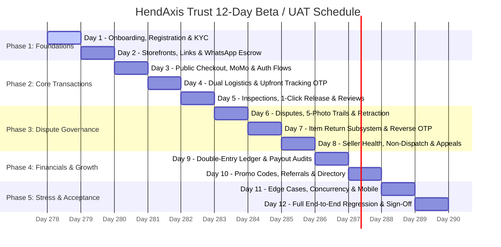
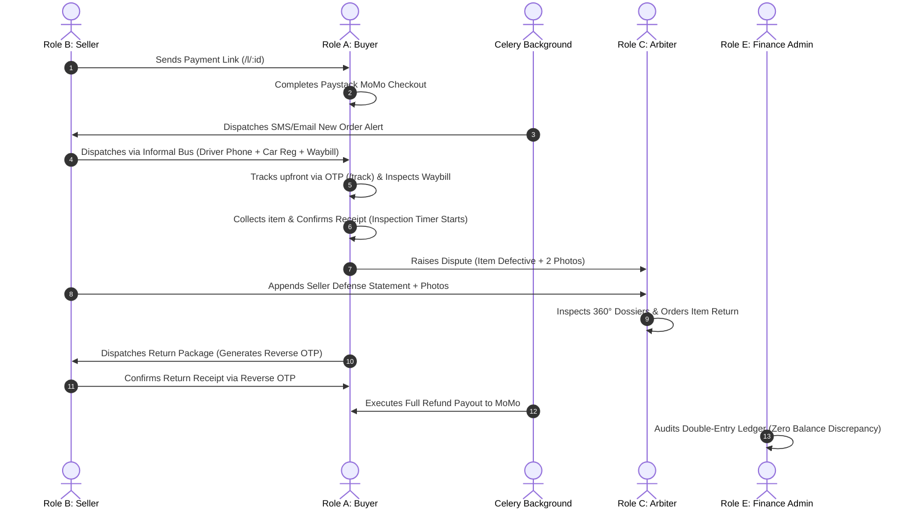
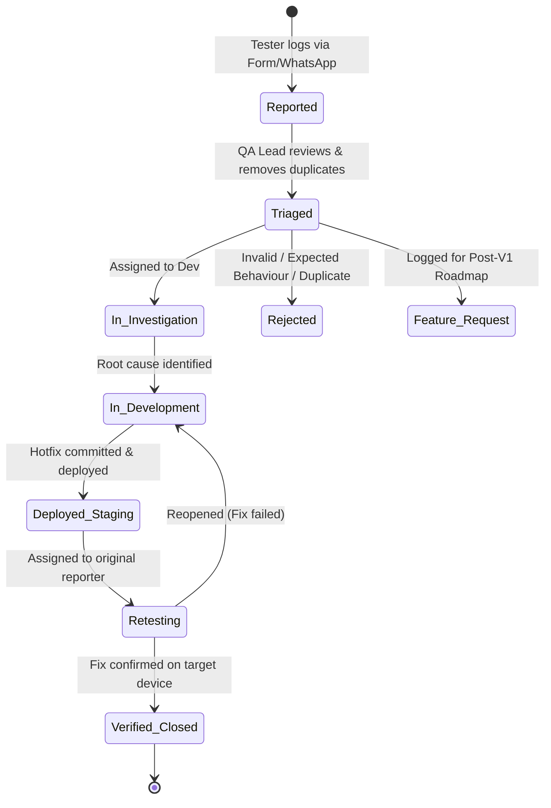

# HendAxis Trust — Master Beta / User Acceptance Testing (UAT) Execution Plan

> **Author**: Senior QA Engineer, Software Test Manager & Django Web Application Specialist  
> **Platform**: HendAxis Trust (Django Ninja Backend + React 18 Frontend + Celery/Redis + Double-Entry Ledger)  
> **Target Execution Window**: 12 Days (with 2-day buffer for final regression, total 14 days)  
> **Testing Effort**: ~2 Hours / Day per Participant  
> **Communication Channel**: Dedicated WhatsApp Testing Group + Centralized Issue Tracker  

---

## Executive Summary & System Context

**HendAxis Trust** is a multi-tier financial escrow, marketplace trust framework, and payment routing engine engineered for high-security transactions in Ghana. The platform interfaces buyers, merchants (sellers), dispute arbiters, compliance officers, finance accountants, and platform administrators.

Because the system manages real financial value using an **immutable double-entry accounting ledger**, non-dispatch penalty logic, tiered inspection windows (24h/48h/72h), Paystack Mobile Money/Card routing, dual-channel logistics verification (Courier API vs. Informal Bus Station OTP), and multi-step dispute arbitration with item returns, **standard generic software testing is strictly insufficient**.

This testing strategy provides a rigorous, role-based, day-by-day 12-day execution regime designed specifically for WhatsApp-coordinated beta testers.

---

## 1. Testing Roles & Team Allocation

### 1.1 Role Definitions & Responsibilities

| Role Name | Platform Persona Represented | Why This Role Is Critical | Primary Target Test Areas | Min Testers | Rec. Testers | Ideal Testers | Safe to Combine? |
|---|---|---|---|:---:|:---:|:---:|:---:|
| **Role A: Consumer Buyer (Guest & Auth)** | Regular online shoppers buying via payment links or marketplace directory | Validates the primary conversion funnel, Paystack MoMo/Card payments, zero-OTP auth flows, upfront tracking OTP, inspection countdowns, receipt releases, and reviews. | Checkout (`/l/:id`), Promo code redemption, Upfront tracking (`/track`), Inspection countdowns, 1-Click Release, Trustpilot-style 3-axis reviews, Referral redemption (`/referrals`). | 3 | 5 | 8 | ❌ No (Must remain authentic consumer perspective) |
| **Role B: Merchant / Store Seller** | Social commerce vendor & e-commerce shop owner | Validates revenue generation, storefront setups, KYC submission, link creation with dynamic fee rules, dispatch tracking with WebP waybills, wallet withdrawals, and dispute defenses. | Storefront (`/store/:username`), KYC upload, Link generation (`/create-link`), 1-Click WhatsApp escrow generator, Order dispatch (Paths A & B), Wallet payouts & withdrawal modes (`/ledger`), Review replies. | 2 | 4 | 6 | ❌ No (Cannot test against own buyer account in same session) |
| **Role C: Dispute Arbiter** | Impartial legal/trust arbitrator | Tests platform governance, neutrality, evidence inspection dossiers, and the 4 dispute settlement calculations. | Admin Portal Dispute Queue (`/admin-portal/dashboard?tab=disputes`), 360° dossiers, subsequent dialogue chat streams, 4 ruling executions, arbiter activity tracking. | 1 | 2 | 3 | ⚠️ Yes (Can be combined with Compliance Officer if strictly separated by test window) |
| **Role D: KYC & Compliance Officer** | Identity verification and risk officer | Ensures bad actors are prevented from getting `🛡️ Verified Seller` badges and manages high-risk merchant suspensions. | Verification Desk (`tab=verifications`), Ghana Card & Business License approval/rejection, Suspension Appeals Desk (`tab=appeals`), Seller risk metrics. | 1 | 2 | 2 | ⚠️ Yes (Can be combined with Arbiter role) |
| **Role E: Finance Admin / Accountant** | Financial controller & ledger auditor | Verifies mathematical ledger balance ($Assets = Liabilities + Equity$), platform fee revenue, gateway expenses, and arbiter payout batches. | Ledger & Funds Audit (`tab=funds`), System Bank clearing accounts, Ad invoice reconciliations (`tab=ad-invoices`), Arbiter payout batch runs. | 1 | 1 | 2 | ❌ No (Requires meticulous financial verification) |
| **Role F: Customer Support Agent** | Frontline helpdesk agent | Validates transaction search, buyer intelligence dossiers, notification logs audit, and user assistance flows. | Notification Center (`/notifications`), Broadcast messaging (`tab=broadcast`), Transaction lookup (`tab=transactions`), Help & Guides center. | 1 | 2 | 2 | ⚠️ Yes (Can be executed by QA Lead) |
| **Role G: Lead QA / Test Manager** | UAT Orchestrator & WhatsApp Coordinator | Coordinates daily prompts, injects mock webhook events, manages Celery time-shifts, triages daily bugs, and manages staging deployments. | Celery task triggers, webhook mock injection, database backups/snapshots, test data distribution, daily WhatsApp briefing. | 1 | 1 | 1 | ❌ Dedicated coordinator |

### 1.2 Team Size Calculation Summary

- **Minimum Total Testers Required**: **9 Participants** (Covers all isolated & cross-role multi-party transactions)
- **Recommended Total Testers**: **16 Participants** (Provides diverse device/browser matrix, concurrent load, and parallel dispute trails)
- **Ideal Total Testers**: **24 Participants** (Maximum realistic beta cohort for comprehensive Ghana telecom/network variability)

### 1.3 Role Combination Rules & Anti-Bias Guidelines
1. **Strict Separation of Buyer & Seller**: Under no circumstance should a tester purchase an item from their own seller account during standard scenarios. This masks permission leaks and session cookie collisions.
2. **Dual-Browser Rule for Multi-Role Testers**: If a QA engineer acts as both Buyer and Admin/Arbiter, they **MUST** use separate isolated browser profiles (e.g., Chrome Profile 1 for Buyer, Firefox Container for Admin) to prevent JWT token pollution.
3. **Realistic Data Rule**: Testers must use realistic Ghanaian phone numbers (MTN, Telecel, AT formats), real product names (e.g., iPhone 13 Pro 128GB, Kente Cloth 3-Piece, PS5 Console), and real local delivery locations (e.g., Circle VIP Station, Madina Zongo Junction, Kasoa Toll Booth).

---

## 2. Testing Infrastructure & Staging Configuration

To ensure safety and zero real-world financial risk while maintaining 100% production fidelity:

```
+-----------------------------------------------------------------------------------+
|                            STAGING ENVIRONMENT TOPOLOGY                           |
+-----------------------------------------------------------------------------------+
|  Frontend: React 18 + Vite (Staging Build, Sentry Observability Enabled)          |
|  Backend: Django 5.x + Django Ninja (DEBUG=False, STAGING_ENVIRONMENT=True)      |
|  Database: PostgreSQL with Point-In-Time Snapshotting & Nightly Dumps             |
|  Async Processing: Redis + Celery Worker + Celery Beat Scheduler                 |
|  Payment Gateway: Paystack Sandbox (Simulated MoMo Wallets & Test Cards)          |
|  Notification Engine: MNotify Mock/Staging Sandbox + HTML Email Sandbox (Mailpit) |
|  Storage Engine: Cloudinary / S3 Test Bucket (1MB WebP compression active)        |
+-----------------------------------------------------------------------------------+
```

### Staging Configuration Checklist

| Parameter | Staging Setting | Rationale |
|---|---|---|
| `DEBUG` | `False` | Catch realistic 500/404 error handlers and CORS policies without leaking debug tracebacks to testers. |
| `PAYSTACK_SECRET_KEY` | `sk_test_...` | Simulates Ghanaian Mobile Money (MTN 0244000001, Telecel, AT) and Card authorizations with zero real charges. |
| `MNOTIFY_API_KEY` | Staging Sandbox / In-App Logger | Prevents massive SMS billing while auto-logging all SMS texts into the user's Notification Center (`/notifications`). |
| `EMAIL_BACKEND` | `django.core.mail.backends.smtp.EmailBackend` (Mailpit / Staging SMTP) | Enables full inspection of rich HTML dispute, dispatch, and receipt confirmation emails. |
| `CELERY_TASK_ALWAYS_EAGER` | `False` | Tests real asynchronous execution of dispatch expiry timers, progressive reminders, and auto-deliveries via Redis. |
| `SENTRY_DSN` | Active Staging DSN | Captures unhandled frontend React runtime errors and backend 500 exceptions with stack traces. |

---

## 3. Comprehensive Day-by-Day Testing Schedule (12-Day Plan)



---

### 📅 Day 1 – Onboarding, Authentication, Security & KYC Identity

- **Objective**: Validate user onboarding, registration, JWT authentication cookies, 2FA TOTP setup, password reset loops, and KYC identity verification workflows.
- **Roles Involved**:
  - `Role A (Buyers)`: **Moderate** (45 mins)
  - `Role B (Sellers)`: **Heavy** (75 mins)
  - `Role D (Compliance)`: **Heavy** (60 mins)
  - `Role G (Lead QA)`: **Heavy** (120 mins)

#### Role-by-Role Task Breakdown (120-minute session)
1. **Role B (Sellers)** [0:00 – 1:15]:
   - Register new merchant account via `/register` with phone, email, shop name, and category tags.
   - Verify phone OTP (6 digits) and verify email confirmation link via `/activate-account`.
   - Navigate to `/profile` -> submit National ID (Ghana Card number + front/back photo) and optional Business Registration license.
   - Enable Two-Factor Authentication (2FA TOTP) using Google Authenticator / Authy. Log out and log back in with TOTP.
   - Update Storefront settings: Shop banner, logo, business description, and 3 category pills.
2. **Role A (Buyers)** [0:30 – 1:15]:
   - Register buyer account, test phone OTP login, and verify email banner.
   - Configure default delivery address in profile (`/profile`).
   - Test password recovery loop (`/forgot-password` -> `/reset-password`).
3. **Role D (Compliance Officers)** [1:15 – 2:00]:
   - Log in to Admin Portal (`/admin-portal/dashboard?tab=verifications`).
   - Inspect submitted Ghana Card credentials and high-res image previews.
   - **Action 1**: Approve Seller #1 and Seller #2 -> verify `🛡️ Verified Seller` badge appears on their public storefront (`/store/:username`).
   - **Action 2**: Reject Seller #3 with formal rejection note ("Ghana card blurry / expired") -> verify seller receives email/SMS and rejection banner on dashboard.

#### Specific Bugs & Vulnerabilities to Watch For
- Token leakage or session dropping when switching between tabs.
- Unverified sellers falsely showing `🛡️ Verified Seller` badge before compliance approval.
- Ability to submit invalid Ghana Card format (e.g., missing `GHA-` prefix).
- File upload bypass with files $> 5\text{MB}$ or non-image formats (`.exe`, `.pdf` when photo expected).

#### Evidence Required
- Screenshot of verified profile badge.
- Compliance rejection notification screenshot.
- Registered usernames and phone numbers logged in WhatsApp group.

---

### 📅 Day 2 – Storefronts, Dynamic Payment Links & 1-Click WhatsApp Escrow

- **Objective**: Test product link generation, fee calculation modes (`ABSORB_FEE` vs. `PASS_TO_BUYER`), category tagging, embeddable trust badges, and the 1-Click WhatsApp Escrow Generator.
- **Roles Involved**:
  - `Role B (Sellers)`: **Heavy** (80 mins)
  - `Role A (Buyers)`: **Moderate** (40 mins)
  - `Role G (Lead QA)`: **Moderate** (60 mins)

#### Role-by-Role Task Breakdown (120-minute session)
1. **Role B (Sellers)** [0:00 – 1:20]:
   - Navigate to `/create-link` -> generate standard payment links across multiple pricing brackets:
     * Link 1: Low-value item (GHS 150 + GHS 20 shipping, `PASS_TO_BUYER`).
     * Link 2: Mid-value item (GHS 3,500 + GHS 50 shipping, `ABSORB_FEE`).
     * Link 3: High-value item (GHS 12,000 + GHS 0 shipping, `PASS_TO_BUYER`).
   - Verify real-time dynamic fee breakdown calculation:
     $$\text{Platform Fee} = (\text{Price} + \text{Shipping}) \times 1.5\% + \text{GHS } 10.00$$
     $$\text{Gateway Fee} = \text{Gross Amount} \times 1.95\%$$
   - Create direct internal order targeted specifically to a registered buyer's phone number (`is_direct_order = True`).
   - Copy public storefront link (`/store/:username`) and post into WhatsApp group.
   - Test embeddable Trust Badge snippet (`/badge/:username.js`) on a test HTML page.
2. **Role A (Buyers)** [1:20 – 2:00]:
   - Visit public seller storefronts (`/store/:username`).
   - Click "Buy via HendAxis Escrow (WhatsApp)" button on product cards.
   - Verify preloaded WhatsApp inquiry text containing prefilled `/create-link` URL with parameters (`title`, `price`, `category`, `img`).
   - Log in and view Direct Orders inbox in `/dashboard?tab=purchases`.

#### Specific Bugs & Vulnerabilities to Watch For
- Math rounding discrepancy in pesewas (e.g., GHS 0.01 mismatch).
- Suspended sellers attempting to generate active links (must trigger appeal block modal).
- XSS injection in Link Title or Description fields.
- Broken image upload previews for product waybills.

#### Evidence Required
- Links posted to WhatsApp group with price & fee breakdown summary.
- Screenshot of WhatsApp prefilled escrow generator message.

---

### 📅 Day 3 – Public Checkout, Multi-Channel Paystack MoMo & Dual-Flow Auth

- **Objective**: Execute transactions across guest shoppers and authenticated buyers using Paystack Mobile Money and Card sandboxes.
- **Roles Involved**:
  - `Role A (Buyers)`: **Heavy** (90 mins)
  - `Role B (Sellers)`: **Light** (30 mins)
  - `Role G (Lead QA)`: **Heavy** (120 mins)

#### Role-by-Role Task Breakdown (120-minute session)
1. **Role A (Buyers - Guest Flow)** [0:00 – 0:50]:
   - Open Link 1 in Incognito/Private window (Unauthenticated Guest).
   - Enter guest details: Buyer Name, Phone Number, Email, Delivery Address.
   - Complete Paystack Checkout using Sandbox MTN Mobile Money (`0244000001` -> OTP `123456`).
   - On payment success screen, complete **Post-Checkout Account Creation**: Enter password -> receive SMS phone OTP and Email verification link -> log in immediately with zero token loss.
2. **Role A (Buyers - Authenticated Zero-OTP Flow)** [0:50 – 1:30]:
   - Log in as authenticated buyer. Open Link 2.
   - Verify delivery address is auto-prefilled from profile.
   - Verify **Zero-OTP 1-Click Paystack initialization** (no SMS OTP modal barrier).
   - Authorize payment via Sandbox Telecel/Card.
3. **Role B (Sellers)** [1:30 – 2:00]:
   - Check Dashboard (`/dashboard`) -> verify order status transitions immediately to `PAYMENT_RECEIVED`.
   - Verify SMS & Email notification received stating exact buyer details and shipping address.
   - Check Wallet balance (`/ledger`) -> verify funds are locked in Escrow (not yet in available balance).

#### Specific Bugs & Vulnerabilities to Watch For
- Duplicate webhook execution creating double transactions or phantom ledger entries.
- Page reload during Paystack redirect losing order state.
- Guest buyer unable to track order immediately after payment.

#### Evidence Required
- Paystack transaction references (`T12345...`) logged to tracking sheet.
- Notification screenshots (SMS/Email) received by both parties.

---

### 📅 Day 4 – Dual Logistics Verification Engine & Upfront OTP Tracking

- **Objective**: Test order fulfillment via Path A (Formal Courier API) and Path B (Informal Bus Station OTP + WebP Waybill), and upfront 6-digit OTP tracking portal (`/tracking`).
- **Roles Involved**:
  - `Role B (Sellers)`: **Heavy** (60 mins)
  - `Role A (Buyers)`: **Heavy** (60 mins)
  - `Role G (Lead QA)`: **Moderate** (60 mins)

#### Role-by-Role Task Breakdown (120-minute session)
1. **Role B (Sellers - Path A Dispatch)** [0:00 – 0:30]:
   - Open Transaction #1 -> Click "Dispatch Order".
   - Select **Path A (Courier)**: Carrier (DHL / FedEx / Speedaf / Ghana Post), enter tracking number and carrier tracking URL.
   - Upload parcel photo (WebP format) -> Submit.
2. **Role B (Sellers - Path B Dispatch)** [0:30 – 1:00]:
   - Open Transaction #2 -> Click "Dispatch Order".
   - Select **Path B (Informal Bus Transport)**: Driver Phone Number (`024xxxxxxx`), Vehicle Car Number (`GT-4821-22`), Destination Station (`VIP Station, Circle`), and Waybill photo.
   - Submit -> Verify transaction status moves to `DELIVERY_IN_PROGRESS`.
3. **Role A (Buyers - Upfront Tracking & Collection)** [1:00 – 2:00]:
   - Visit `/track` without logging in.
   - Enter Transaction ID + Phone Number -> request 6-digit upfront OTP -> enter OTP.
   - Verify order details unlock completely: driver phone, car registration, package waybill photo, and dispatch status.
   - Authenticated Buyers: Open `/track` while logged in -> verify **Instant 1-Click Query** across matching phone/email with 0 OTP prompts.

#### Specific Bugs & Vulnerabilities to Watch For
- Informal bus dispatch failing to generate buyer Secret Bus OTP.
- Upfront tracking OTP cooldown timer bypass (must enforce 60s cooldown and 2h session validity).
- Exposure of sensitive seller payout details in public tracking response.

#### Evidence Required
- Screenshot of unlocked tracking timeline.
- Waybill photo rendering verification.

---

### 📅 Day 5 – Tiered Buyer Inspection Periods, 1-Click Release & Verified Reviews

- **Objective**: Test delivery handoff confirmation, tiered inspection timers (24h for $< 2\text{k}$, 48h for $2\text{k}-10\text{k}$, 72h for $\ge 10\text{k}$), 1-click escrow payout release, and 3-axis review ratings.
- **Roles Involved**:
  - `Role A (Buyers)`: **Heavy** (70 mins)
  - `Role B (Sellers)`: **Moderate** (50 mins)
  - `Role E (Finance Admin)`: **Light** (30 mins)

#### Role-by-Role Task Breakdown (120-minute session)
1. **Role A (Buyers - Receipt & Inspection)** [0:00 – 0:45]:
   - Open `/dashboard?tab=purchases` -> Click "Confirm Receipt" (or enter 6-digit Delivery Confirmation Code for informal bus).
   - Verify transaction moves to `INSPECTION_PERIOD`.
   - Verify inspection countdown badge reflects tier:
     * Order 1 (GHS 170): 24-Hour Timer.
     * Order 2 (GHS 3,550): 48-Hour Timer.
     * Order 3 (GHS 12,000): 72-Hour Timer.
2. **Role A (Buyers - Approve & Release)** [0:45 – 1:15]:
   - Click "Approve & Release Funds" on Order 1.
   - Verify status transitions to `COMPLETED`.
   - Leave verified review: Rate Speed (5★), Communication (4★), Overall (5★) + Text Comment + Unboxing Photo.
3. **Role B (Sellers - Payout & Review Reply)** [1:15 – 2:00]:
   - Verify Instant Payout: Available wallet balance updates immediately.
   - View public storefront (`/store/:username`) -> verify review is visible with `🛡️ Verified Purchase` badge.
   - Post seller reply to buyer review -> verify reply displays nested under review.

#### Specific Bugs & Vulnerabilities to Watch For
- Unauthenticated users attempting to post reviews (must strictly enforce 1 review per completed transaction via `buyer_review_token`).
- Incorrect inspection tier assignment (e.g., GHS 5,000 order getting 24h instead of 48h).
- Double release request (double-clicking release button causing duplicate payout).

#### Evidence Required
- Screenshot of completed order payout in Seller Wallet.
- Screenshot of verified review on seller store.

---

### 📅 Day 6 – Dispute Resolution Engine, 5-Photo Trail, Retraction & Arbitration

- **Objective**: Test buyer dispute raising, subsequent dialogue appends (`--- [Update] ---`), 5-photo evidence trail, dispute retraction, and arbiter dossier inspection.
- **Roles Involved**:
  - `Role A (Buyers)`: **Heavy** (60 mins)
  - `Role B (Sellers)`: **Heavy** (50 mins)
  - `Role C (Arbiters)`: **Heavy** (60 mins)

#### Role-by-Role Task Breakdown (120-minute session)
1. **Role A (Buyers - Raise Dispute)** [0:00 – 0:30]:
   - Open active order in `INSPECTION_PERIOD` -> Click "Raise Dispute".
   - Select Dispute Category (e.g., `ITEM_NOT_AS_DESCRIBED` / `DAMAGED_ITEM`), provide explanation, and attach 2 photos.
   - Verify transaction status moves to `DISPUTED` and existing review permissions are suppressed.
   - Test subsequent dialogue append: Add extra photo and message update ("Seller sent wrong color") -> verify chronological append without overwriting initial claim.
2. **Role B (Sellers - Dispute Counter-Claim)** [0:30 – 1:00]:
   - Open disputed order in Seller Dashboard.
   - Submit seller defense statement + package dispatch photo evidence.
   - Verify WhatsApp-style unified chat timeline renders color-coded buyer and seller cards.
3. **Role C (Dispute Arbiters)** [1:00 – 2:00]:
   - Access Arbiter Portal (`/admin-portal/dashboard?tab=disputes`).
   - Open **Arbitration 360° Intelligence Dossiers**:
     * Buyer Dossier: Lifetime orders, dispute rate %, serial disputer flags.
     * Seller Dossier: Dispute health score, historical rulings, GMV.
   - Post formal Arbiter Instruction ("Both parties please provide serial number photo within 24h").
   - Test **Dispute Retraction Flow**: Buyer voluntarily clicks "Retract Dispute" on `/l/:id` -> verify 24-hour settlement release timer initiates.

#### Specific Bugs & Vulnerabilities to Watch For
- Ability to upload more than 5 photos per party.
- Evidence photo exceeding 1MB limit breaking layout.
- Review rating still displaying publicly after dispute is raised.

#### Evidence Required
- Screenshots of WhatsApp-style dispute chat timeline.
- Arbiter 360° dossier audit logs.

---

### 📅 Day 7 – Item Return Subsystem, Reverse Pickup OTP & Ruling Settlements

- **Objective**: Execute all 4 dispute resolution rulings: `RELEASE_TO_SELLER`, `FULL_REFUND_TO_BUYER`, `PARTIAL_REFUND_TO_BUYER`, and `REQUIRE_RETURN_FROM_BUYER` with Reverse Pickup OTP.
- **Roles Involved**:
  - `Role C (Arbiters)`: **Heavy** (70 mins)
  - `Role A (Buyers)`: **Moderate** (50 mins)
  - `Role B (Sellers)`: **Moderate** (50 mins)
  - `Role E (Finance Admin)`: **Light** (30 mins)

#### Role-by-Role Task Breakdown (120-minute session)
1. **Role C (Arbiters - Execute Rulings)** [0:00 – 0:45]:
   - **Case 1**: Rule `FULL_REFUND_TO_BUYER` -> Verify automated refund queued back to Paystack MoMo.
   - **Case 2**: Rule `PARTIAL_REFUND_TO_BUYER` (Split: GHS 600 to Seller, GHS 400 to Buyer, GHS 20 Platform Fee).
   - **Case 3**: Rule `REQUIRE_RETURN_FROM_BUYER` -> Status moves to `RETURN_IN_PROGRESS` with 3-day return dispatch window.
2. **Role A (Buyers - Item Return Dispatch)** [0:45 – 1:15]:
   - On Case 3 order -> Click "Dispatch Return Package".
   - Select Informal Bus Return: Enter Driver Phone, Vehicle Reg, Station, and Waybill Photo.
   - Receive **6-Digit Reverse Pickup OTP**.
3. **Role B (Sellers - Return Verification & Auto-Refund)** [1:15 – 2:00]:
   - Inspect returned package -> Click "Confirm Return Received" using the Reverse Pickup OTP.
   - Verify transaction moves to `REFUNDED` and buyer is credited.
   - Test Inactivity Timeout: Lead QA simulates 48h return timeout -> verify Celery `process_auto_return_refunds` executes refund automatically.

#### Specific Bugs & Vulnerabilities to Watch For
- Unallocated split funds in partial refund leaking out of double-entry ledger.
- Reverse OTP bypass allowing seller to claim return without valid verification.
- Return dispatch window expiring without sending progressive warnings.

#### Evidence Required
- Dispute resolution ruling summaries.
- Reverse OTP verification confirmation screenshot.

---

### 📅 Day 8 – Seller Health Governance, Non-Dispatch Expiries & Suspension Appeals

- **Objective**: Test Celery non-dispatch auto-cancellation (4-day timeout), non-dispatch penalties, seller health governance (auto-suspension at 35% default rate), and the Suspension Appeals Desk.
- **Roles Involved**:
  - `Role B (Sellers)`: **Heavy** (60 mins)
  - `Role D (Compliance)`: **Heavy** (60 mins)
  - `Role G (Lead QA)`: **Heavy** (90 mins)

#### Role-by-Role Task Breakdown (120-minute session)
1. **Role G (Lead QA & Celery Trigger)** [0:00 – 0:30]:
   - Seed test transaction in `PAYMENT_RECEIVED` status with timestamp backdated $> 4\text{ days}$.
   - Trigger Celery task `check_expired_dispatches.delay()`.
2. **Role B (Sellers - Penalty & Suspension)** [0:30 – 1:15]:
   - Verify order is auto-cancelled (`auto_cancelled_non_dispatch = True`).
   - Verify buyer receives 100% full refund notification.
   - Verify seller wallet balance is charged the **Non-Dispatch Default Penalty**:
     $$\text{Penalty} = \text{Platform Fee} + 1.95\% \text{ Gateway Fee}$$
   - Trigger auto-suspension threshold (exceeding 35% non-dispatch rate with $N \ge 5$).
   - Attempt to log in and create links -> verify account is locked with interactive **Suspension Appeal Modal**.
   - Submit formal appeal with remediation plan.
3. **Role D (Compliance Officers - Appeals Desk)** [1:15 – 2:00]:
   - Open Admin Portal Appeals Desk (`/admin-portal/dashboard?tab=appeals`).
   - Review appeal statement and merchant history -> Click "Approve & Reinstate".
   - Verify **Clean Slate Reinstatement**: `reinstated_at = timezone.now()` is recorded so historical defaults do not trigger an immediate re-suspension loop.

#### Specific Bugs & Vulnerabilities to Watch For
- In-flight active orders belonging to a suspended seller getting blocked from completion (in-flight orders must continue uninterrupted).
- Reinstated sellers instantly re-suspended on the next Celery health check cycle.
- Penalty calculation charging incorrect gateway fee percentage.

#### Evidence Required
- Screenshot of Non-Dispatch penalty deduction in seller ledger.
- Approved appeal and reinstated account confirmation.

---

### 📅 Day 9 – Double-Entry Financial Ledger, Payout Modes & Accountant Audit

- **Objective**: Conduct full mathematical audit of double-entry ledger accounts ($Assets = Liabilities + Equity$), instant vs. manual payout modes, bank account name verification, and arbiter batch payouts.
- **Roles Involved**:
  - `Role E (Finance Admins)`: **Heavy** (90 mins)
  - `Role B (Sellers)`: **Moderate** (50 mins)
  - `Role C (Arbiters)`: **Light** (30 mins)

#### Role-by-Role Task Breakdown (120-minute session)
1. **Role E (Finance Admins - Balance Sheet Audit)** [0:00 – 1:00]:
   - Open Financial Portal (`/admin-portal/dashboard?tab=funds`).
   - Verify real-time balance sheet integrity across all intermediate clearing accounts:
     * `System Bank Assets` (Cash held at Paystack bank account)
     * `Buyer Escrow Deposits` (Liability: Funds held awaiting delivery/inspection)
     * `Seller Wallet Liabilities` (Liability: Available seller balances awaiting withdrawal)
     * `Platform Fee Revenue` (Equity/Revenue: Earned platform escrow fees)
     * `Gateway Fee Expenses` (Expense: 1.95% Paystack processing fees incurred)
   - Verify Ledger Invariant:
     $$\sum \text{Debits} = \sum \text{Credits}$$
     $$\text{Bank Assets} = \text{Escrow Deposits} + \text{Seller Liabilities} + \text{Platform Revenue} - \text{Gateway Expenses}$$
2. **Role B (Sellers - Payout Mode Testing)** [1:00 – 1:40]:
   - Toggle Payout Mode in profile between `INSTANT` and `MANUAL`.
   - Complete an order under `MANUAL` -> verify funds remain in available wallet balance.
   - Request Manual Withdrawal to MoMo / Bank Account -> verify Paystack transfer fee is deducted and transfer reference recorded.
3. **Role E (Finance Admins - Arbiter Payout Batch)** [1:40 – 2:00]:
   - Open Arbiter Balances tab (`tab=finance`).
   - Review resolved dispute arbitration earnings -> Create Arbiter Payout Batch.

#### Specific Bugs & Vulnerabilities to Watch For
- Unbalanced debit/credit ledger entries (orphan rows).
- Double-withdrawal race condition (rapid clicking "Withdraw" button withdrawing funds twice).
- Negative wallet balance when withdrawing full amount.

#### Evidence Required
- Double-entry balance sheet export/screenshot showing 0.00 GHS imbalance.
- Immutable payout destination audit record snapshot.

---

### 📅 Day 10 – Promotions, Referral Engine, Cashback & Marketplace Directory

- **Objective**: Test promo code discounts, seasonal fee overrides, transaction cashback rewards, double-sided referral engine (`/referrals`), and ballpark search directory (`/shops`).
- **Roles Involved**:
  - `Role A (Buyers)`: **Heavy** (60 mins)
  - `Role B (Sellers)`: **Heavy** (60 mins)
  - `Role G (Lead QA)`: **Moderate** (45 mins)

#### Role-by-Role Task Breakdown (120-minute session)
1. **Role A & B (Referral Engine Testing)** [0:00 – 0:40]:
   - User 1 copies unique referral link (`/ref/:code`) from `/referrals` and sends to User 2.
   - User 2 registers using referral code -> completes qualifying purchase ($\ge \text{GHS } 50.00$).
   - Upon order completion, verify automated dual reward distribution:
     * Referrer receives GHS 15.00 wallet bonus credits.
     * Referee receives GHS 10.00 discount credits.
   - Test anti-self-referral safeguard: User attempts to register with own referral code or duplicate phone -> must be blocked.
2. **Role A (Buyers - Promo Codes & Seasonal Campaigns)** [0:40 – 1:15]:
   - Test Promo Code `BETA2026` on checkout -> verify platform fee discount applies with strict floor ($\text{Fee} \ge \text{GHS } 0.00$).
   - Verify **Seller Payout Protection Rule**: Promotional discounts and cashback offsets reduce the platform fee, **never** deducting from the seller's agreed item price or delivery earnings.
3. **Role A (Buyers - Marketplace Directory & Ballpark Search)** [1:15 – 2:00]:
   - Visit `/shops` directory -> test category filter pills (16 categories).
   - Test multi-token ballpark search: Query partial keywords (e.g., "iph 128", "sams galax") -> verify matching stores and product cards.
   - Test Sponsored Shops tier placement and verified reviews carousel.

#### Specific Bugs & Vulnerabilities to Watch For
- Promo code reducing total price below merchandise cost.
- Per-buyer promo usage limit bypass (using promo code twice under same phone).
- Referral bonus granted for uncompleted or disputed orders.

#### Evidence Required
- Referral dashboard credit balance screenshot.
- Checkout receipt showing promo code fee discount line item.

---

### 📅 Day 11 – Edge Cases, Concurrency, Interruption & Negative Security Testing

- **Objective**: Subject the platform to malicious inputs, network dropouts, concurrent race conditions, permission privilege escalations, and mobile responsive stresses.
- **Roles Involved**:
  - `All Roles (A, B, C, D, E, F)`: **Heavy** (120 mins)
  - `Role G (Lead QA)`: **Heavy Orchestration** (120 mins)

#### Structured Edge-Case Testing Matrix (120-minute session)

| Test Category | Test Action & Scenario | Expected System Behavior |
|---|---|---|
| **Concurrency Race Condition** | Buyer clicks "Approve & Release" at the exact same second Arbiter issues a dispute refund. | Database `select_for_update()` lock prevents double-payout. First action commits, second is safely rejected with "Transaction already settled". |
| **Rapid Double Click** | Tester double-clicks "Pay Now" or "Generate Link" button within 100ms. | Button disables immediately on first click; backend idempotency key prevents duplicate transaction creation. |
| **Network Interruption** | Disconnect Wi-Fi/data while Paystack checkout modal is processing, then reconnect 30s later. | System detects pending status on reload, queries gateway status via webhook/poll, and resumes without losing transaction state. |
| **Browser Back Navigation** | Click browser Back button after successful payment callback. | User is redirected to completed transaction receipt; payment is NOT re-initialized. |
| **Privilege Escalation** | Regular Buyer attempts to access `/admin-portal/dashboard` or call `POST /api/v1/admin/sellers/{id}/suspend`. | Backend returns HTTP 403 Forbidden; frontend redirects to `/dashboard` with security notice. |
| **Boundary Value Pricing** | Create link with GHS 0.01 price, GHS 0.00 shipping, and GHS 999,999.00 price. | Dynamic fee calculator validates minimum floor ($\ge \text{GHS } 1.00$) and enforces max decimal precision without floating-point errors. |
| **Mobile MoMo Stresses** | Perform full checkout and tracking on low-end Android mobile Chrome and iOS Safari. | Responsive drawer navigation renders cleanly without horizontal scroll overflow; virtual keyboard does not obscure OTP inputs. |

#### Specific Bugs & Vulnerabilities to Watch For
- HTTP 500 Unhandled exceptions during network dropouts.
- JWT token expiration leaving UI in infinite spinner state.
- Inconsistent mobile modal positioning or broken touch targets.

#### Evidence Required
- Screen recording of concurrent action attempts.
- Console error logs and network tab HAR files for any failed requests.

---

### 📅 Day 12 – End-to-End Regression, Bug Verification & Production Sign-Off

- **Objective**: Verify all hotfixes deployed during Days 1–11, execute final end-to-end golden path regression, and conduct final production readiness sign-off.
- **Roles Involved**:
  - `All Roles`: **Full Participation** (120 mins)

#### Role-by-Role Task Breakdown (120-minute session)
1. **All Testers (Bug Verification Queue)** [0:00 – 1:00]:
   - Retest all resolved bug tickets marked `READY_FOR_RETEST` in the tracker.
   - Verify fix on staging environment across both mobile and desktop browsers.
   - Transition verified tickets to `CLOSED` or reopen failed fixes with updated reproduction steps.
2. **All Testers (Golden Path End-to-End Run)** [1:00 – 1:45]:
   - Execute one pristine end-to-end multi-role transaction:
     * Seller creates link with category tag -> Buyer pays via MoMo -> Seller dispatches via Bus with waybill -> Buyer tracks upfront via OTP -> Buyer confirms receipt -> Inspection timer activates -> Buyer approves payout -> Seller wallet receives funds -> Buyer leaves 5★ review -> Seller replies.
3. **QA Lead & Stakeholders (Production Readiness Gate)** [1:45 – 2:00]:
   - Audit final Bug Severity Metrics against Exit Criteria.
   - Generate UAT Acceptance Sign-Off Certificate.

---

## 4. Cross-Role Multi-User Interaction Flows

To ensure realistic testing, participants must execute choreographed multi-user interactions:



---

## 5. Realistic Test Scenario Bank

Every workflow must be tested across the 7 critical scenario dimensions:

```
+-----------------------------------------------------------------------------------+
|                        SCENARIO TESTING COMPASS MATRIX                            |
+-----------------------------------------------------------------------------------+
| 1. NORMAL: Expected golden path with standard valid inputs.                       |
| 2. NEGATIVE: Invalid inputs, wrong OTPs, expired links, unauthorized roles.       |
| 3. BOUNDARY: Edge values (GHS 1.00, GHS 1,999.99 vs 2,000, max image uploads).     |
| 4. PERMISSION: Buyer accessing admin routes, unverified seller claiming badge.   |
| 5. INTERRUPTION: Network drop during MoMo authorization, back-button after pay.  |
| 6. DUPLICATE: Rapid double-clicking release, duplicate webhook deliveries.        |
| 7. CONCURRENCY: Simultaneous release vs dispute, multi-device login sessions.     |
+-----------------------------------------------------------------------------------+
```

---

## 6. Bug Reporting & Triage System

### 6.1 WhatsApp Group Protocol vs. Formal Issue Tracker

To maximize tester engagement without losing structured defect management:
1. **WhatsApp Group Role**: Used for real-time announcements, daily goal prompts, immediate blocker alerts, pairing buyers with sellers, and quick screenshot sharing.
2. **Centralized Tracker (Google Forms / GitHub Issues / Notion)**: Used for formal logging, status tracking, developer assignment, and retesting verification.

### 6.2 Standard Bug Report Template

Testers must submit issues using this exact template in the formal tracker (or formatted in WhatsApp for high-priority blockers):

```markdown
### 🐞 [BUG] - Short Descriptive Title

- **Bug ID**: (Auto-assigned or e.g., BUG-042)
- **Date & Time**: 2026-10-06 14:35 GMT
- **Tester Name**: Kwesi Mensah
- **Assigned Role**: Role A (Buyer)
- **Device & OS**: Samsung Galaxy S22 / Android 13
- **Browser**: Chrome Mobile v122
- **Page URL / Feature**: `/l/b9e2f47a-8b1a-4f5e` (Checkout Page)

#### 📝 Steps to Reproduce
1. Open payment link as guest user.
2. Enter delivery details and proceed to Paystack modal.
3. Complete MoMo payment successfully.
4. On post-checkout screen, enter password to create account.
5. Click "Verify Phone OTP".

- **Expected Result**: Phone OTP modal opens and accepts 6-digit code.
- **Actual Result**: Screen remains stuck on loading spinner; console shows HTTP 500 error.
- **Severity**: 🔴 Critical / 🟠 High / 🟡 Medium / 🔵 Low / ⚪ Cosmetic
- **Frequency**: Always (100%) / Sometimes / Once
- **Evidence Attached**: Screenshot / Screen recording URL attached
- **Additional Context / Order Reference**: Tx Ref `HT-TXN-884210`
```

### 6.3 Severity Classification Matrix

| Severity Level | Non-Technical Definition for Testers | Target SLA for Fix |
|---|---|:---:|
| 🔴 **Critical** | System crash, financial loss, ledger imbalance, money deducted without order creation, security breach, complete blocker with no workaround. | $< 4\text{ Hours}$ |
| 🟠 **High** | Core workflow blocked (e.g., cannot dispatch order, dispute button disabled, tracking OTP not sending), but workaround exists. | $< 12\text{ Hours}$ |
| 🟡 **Medium** | Feature functions incorrectly in non-critical flow (e.g., review star count off by 1, filter pill styling misaligned, slow query). | $< 24\text{ Hours}$ |
| 🔵 **Low** | Minor functional defect or wording ambiguity that does not prevent task completion. | $< 48\text{ Hours}$ |
| ⚪ **Cosmetic** | Visual styling glitch, typo, dark mode contrast irregularity, font sizing inconsistency. | Next Release Cycle |

---

## 7. Bug Lifecycle & Governance



### Triage Decision Authority
- **Genuine Bug vs. Expected Behavior**: QA Lead & Lead Developer.
- **Usability Friction vs. Feature Request**: Product Manager / UI-UX Lead.
- **Ledger / Financial Discrepancy**: Lead Architect & Finance Admin.

---

## 8. Tester Code of Conduct & Onboarding Instructions

*These instructions should be pinned in the WhatsApp group description and emailed to all participants prior to Day 1.*

```
================================================================================
                    HENDAXIS TRUST BETA TESTER HANDBOOK
================================================================================

Welcome to the HendAxis Trust Beta Testing Team! Your testing will directly protect
buyers and sellers across Ghana. Please adhere to these golden rules:

1. 🎯 FOLLOW THE DAILY SCHEDULE: Focus on the day's assigned objectives before
   exploring freely.
2. 📸 EVIDENCE IS KING: Always take a screenshot or screen recording BEFORE 
   refreshing the page if you encounter an error.
3. 💰 SANDBOX MONEY ONLY: Never enter real Mobile Money PINs or real bank card
   details. Use the provided Paystack Sandbox test numbers.
4. 🛑 NO FAKE DATA ACCIDENTS: Use realistic Ghanaian names, phone numbers, and
   addresses so logs reflect real-world usage.
5. 🔍 REPORT IMMEDIATELY: Never assume someone else has already reported a bug.
6. 🔒 CONFIDENTIALITY: Do not share staging credentials, test links, or internal
   discussions outside this WhatsApp group.
7. 🤝 RESPECT FELLOW TESTERS: When testing cross-role transactions, communicate
   courteously and promptly when your partner is waiting for an action.
================================================================================
```

---

## 9. Test Data Strategy & Database Management

### 9.1 Test Credentials & Sandboxes

- **Paystack MoMo Sandbox Numbers**:
  - MTN MoMo: `0244000001` (OTP: `123456`) -> Simulated Success
  - Telecel Cash: `0200000002` (OTP: `123456`) -> Simulated Success
  - AT Money: `0270000003` (OTP: `123456`) -> Simulated Success
  - Failed MoMo Simulation: `0244000002` -> Insufficient Funds
- **Paystack Card Sandbox**: `4084 0840 8408 4084` (Expiry: `12/28`, CVV: `408`, OTP: `123456`).

### 9.2 Database Snapshot & Persistence Protocol
- **Zero Mid-Day Database Resets**: Developers must **NEVER** drop the database during active testing hours (10:00 AM – 8:00 PM GMT). Doing so destroys active multi-day dispute and delivery states.
- **Nightly Schema Migrations**: Schema migrations and bug fixes are deployed in a scheduled maintenance window (10:00 PM – 11:00 PM GMT) with automated database backups (`pg_dump`).
- **Data Fixtures**: Seed scripts populate pre-created categories, test promo codes (`BETA2026`, `WELCOME10`), and verified baseline stores.

---

## 10. Daily QA Review & Developer Workflow

At the end of each testing day, the QA Lead and Development team execute a 30-minute triage cycle:

```
[20:00 GMT] Testing Session Closes
      │
      ▼
[20:15 GMT] QA Lead exports all submitted reports & deduplicates
      │
      ▼
[20:30 GMT] Daily Triage Call: Assign Critical & High issues to Developers
      │
      ▼
[22:00 GMT] Developers deploy hotfixes to Staging & verify build
      │
      ▼
[22:30 GMT] QA Lead posts "Day X Summary & Day X+1 Targets" in WhatsApp Group
```

---

## 11. Entry & Exit Criteria (Production Gate)

### 11.1 Entry Criteria (Prerequisites to Begin Beta)
- [x] Staging backend running Django 5.x with `DEBUG=False`.
- [x] Celery worker and Celery beat active with Redis broker.
- [x] Paystack test mode verified for MoMo and Card payments.
- [x] All automated unit and integration tests passing (`run_all_tests.py` = 100% green).
- [x] Minimum 9 testers recruited and onboarded in WhatsApp group.

### 11.2 Exit Criteria (Production Launch Readiness Gate)

| Metric / Dimension | Production Launch Threshold | Status |
|---|:---:|:---:|
| **Critical Bugs (Severity 1)** | **0 Open** (Zero tolerance) | 🔴 Gatekeeper |
| **High Bugs (Severity 2)** | **0 Open** (Zero tolerance on financial/auth flows) | 🔴 Gatekeeper |
| **Medium Bugs (Severity 3)** | $\le 2$ Open (With documented low-impact workaround) | 🟡 Acceptable |
| **Low / Cosmetic Bugs** | $\le 5$ Open (Scheduled for post-launch sprint) | 🟢 Acceptable |
| **Double-Entry Ledger Imbalance** | **GHS 0.00** (Zero discrepancy across all entries) | 🔴 Gatekeeper |
| **Core Workflow Success Rate** | $\ge 98.5\%$ Successful Completion | 🔴 Gatekeeper |
| **SMS / Email Delivery Reliability** | $\ge 99.0\%$ Notification Dispatch Rate | 🟢 Required |
| **Mobile Responsiveness Pass Rate** | 100% on iOS Safari & Android Chrome | 🔴 Gatekeeper |

---

## 12. Final Sign-Off Deliverables Package

Upon successful completion of the 12-day UAT exercise, the following artifacts must be signed by the QA Lead, Lead Architect, and Platform Founder:

1. **Role-to-Tester Allocation Register** (Complete mapping of participants to roles).
2. **Defect Log & Resolution Report** (Full history of logged, triaged, and verified bugs).
3. **Double-Entry Ledger Financial Reconciliation Audit** (Proof of zero balance mismatch).
4. **Mobile Device & Telecom Compatibility Matrix** (MTN, Telecel, AT network testing results).
5. **Production Readiness Sign-Off Certificate**.
